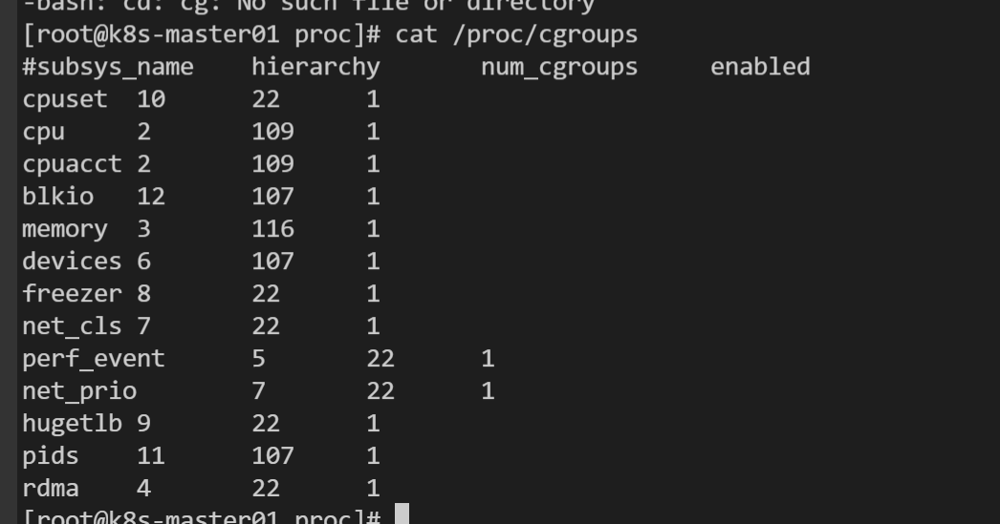

[kubelet cgroup分析](https://zhuanlan.zhihu.com/p/390191211)

1、查看 cgroup 子系统

```shell
/sys/fs/cgroup
```

2、子系统介绍

blkio：对输入/输出访问存取块设备设定权限。

cpu：使用 CPU 调度程序让 cgroup 的任务可以存取 CPU。它与 cpuacct 管控器一起挂载在同一 mount 上。

cpuacct：自动生成 cgroup 中任务占用 CPU 资源的报告。它与 CPU 管控器一起挂载在同一 mount 上。

cpuset：给 cgroup 中的任务分配独立 CPU（在多芯系统中）和内存节点。

devices：允许或禁止 cgroup 中的任务存取设备。

freezer：暂停或恢复cgroup中的任务。

memory：对cgroup中的任务可用内存做出限制，并且自动生成任务占用内存资源报告。

net_cls：使用等级识别符（classid）标记网络数据包，这让Linux流量控制器（tc指令）可以识别来自特定cgroup任务的数据包。

perf_event：允许使用perf工具来监控cgroup。

hugetlb：允许使用大篇幅的虚拟内存页，并且给这些内存页强制设定可用资源量。

---
kubelet 使用的子系统：
- cpu
- cpuacct
- cpuset
- memory
- systemd

cpu.cfs_period_us：此参数可以设定重新分配cgroup可用CPU资源的时间间隔。

cpu.cfs_quota_us：此参数可以设定在某一阶段（由cpu.cfs_period_us规定）某个cgroup中所有任务可运行的时间总量。

cpu.shares：此参数用一个整数来设定cgroup中任务CPU可用时间的相对比例。

memory.limit_in_bytes：设定用户内存（包括文件缓存）的最大用量。

memory.oom_control：当触发oom时oom-killer的行为。

