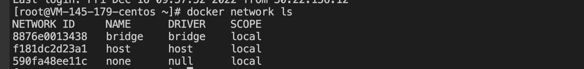
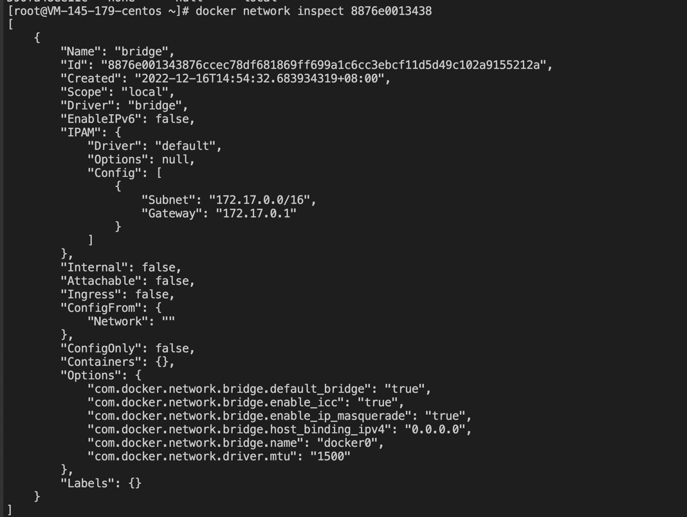
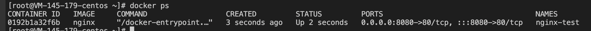
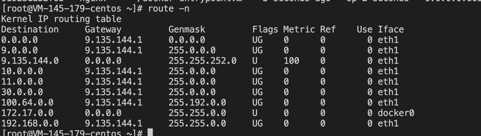

[一文彻悟容器网络通信](https://mp.weixin.qq.com/s/Hr9qpkfTWP9jxYR2sNOeFA)

### Docker 网络模式
- bridge
- host
- container
- none

bridge 模式：


1、docker 启动后默认创建的 docker0 网桥
```shell
brctl show
```


查看路由
```shell
route -n
```


2、常用的 Docker 网络技巧
1）查看容器 IP
```shell
docker inspect -f "{{ .NetworkSettings.IPAddress }}" <containerID or Name>
```

---
1) 查看节点上的 docker 网络
```shell
docker network ls
```


2) 查看网络信息
```shell
docker network inspect network_id
```



3) 运行一个 nginx 容器
```shell
docker run --name nginx-test -p 8080:80 -d nginx
```

4) 查看当前运行的容器
```shell
docker ps
```


5) 查看节点上的路由
```shell
route -n
```



