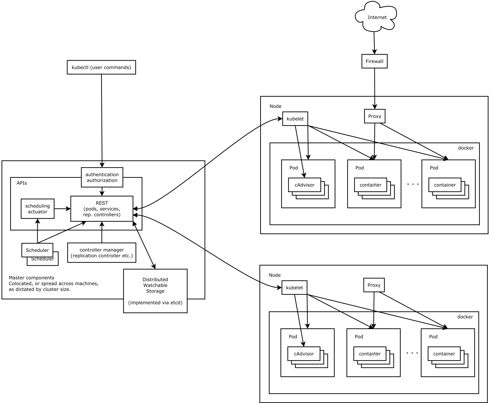
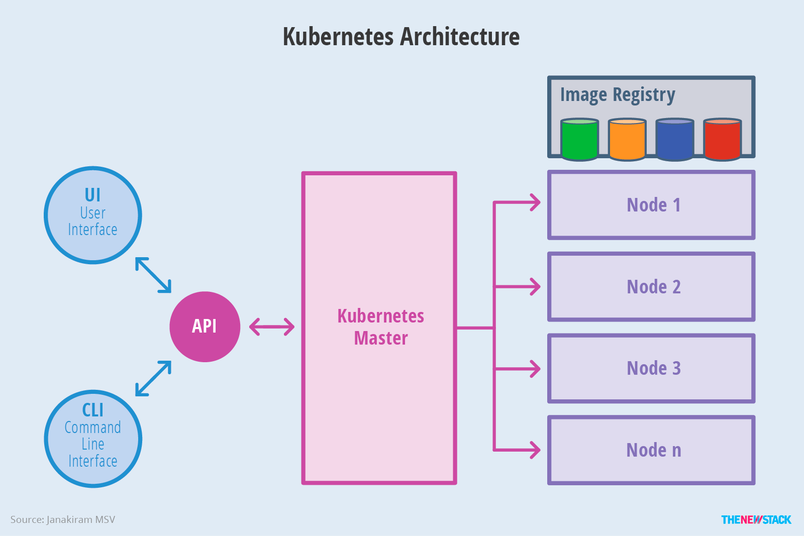
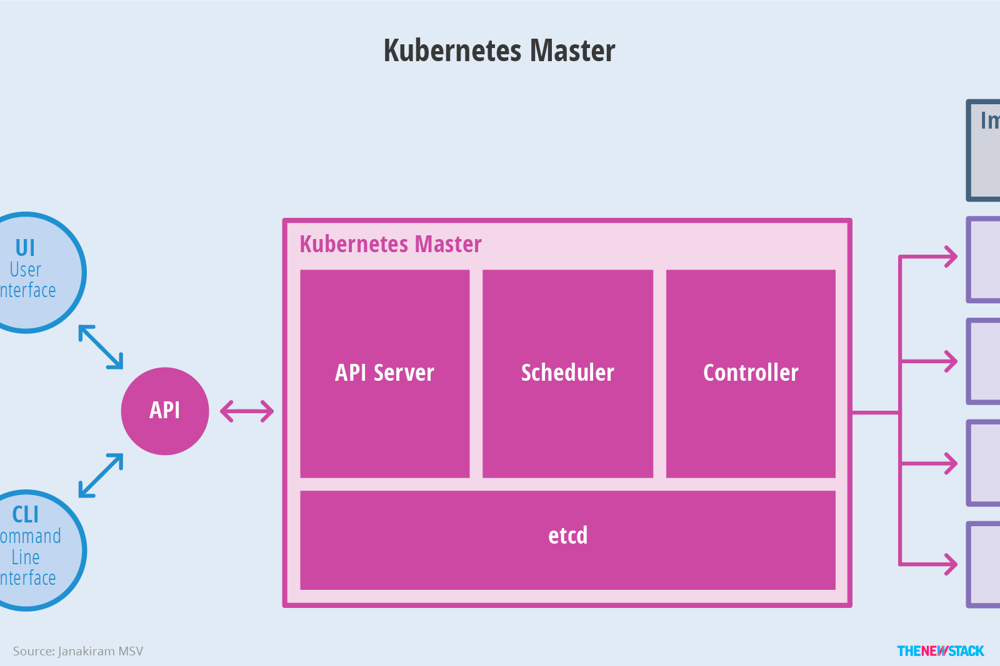
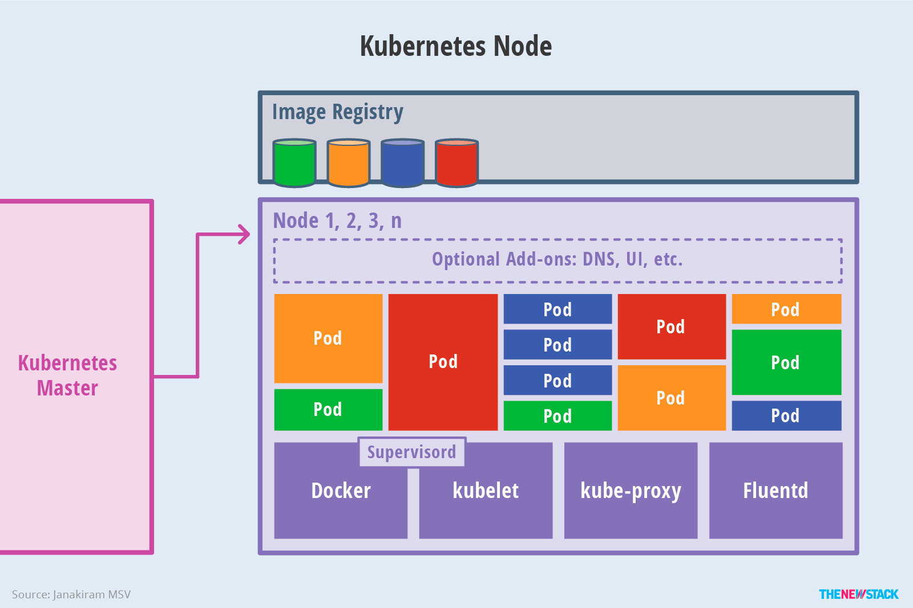
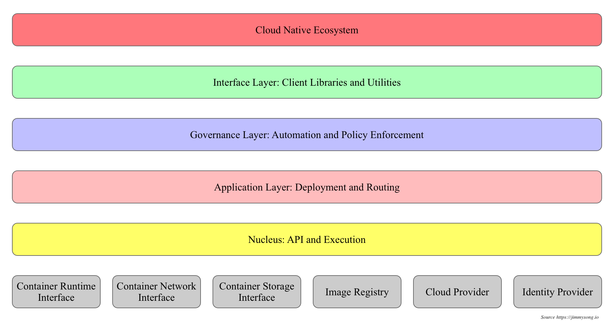

### Kubernetes 架构简介

1、kube-apiserver:  
如果需要与您的 Kubernetes 集群进行交互，就要通过 API。
Kubernetes API 是 Kubernetes 控制平面的前端，用于处理内部和外部请求。
API 服务器会确定请求是否有效，如果有效，则对其进行处理。
您可以通过 REST 调用、kubectl 命令行界面或其他命令行工具（例如 kubeadm）来访问 API。

2、kube-scheduler:  
您的集群是否状况良好？如果需要新的容器，要将它们放在哪里？
这些是 Kubernetes 调度程序所要关注的问题。
调度程序会考虑容器集的资源需求（例如 CPU 或内存）以及集群的运行状况。
随后，它会将容器集安排到适当的计算节点。

3、kube-controller-manager:  
控制器负责实际运行集群，而 Kubernetes 控制器管理器则是将多个控制器功能合而为一。
控制器用于查询调度程序，并确保有正确数量的容器集在运行。
如果有容器集停止运行，另一个控制器会发现并做出响应。
控制器会将服务连接至容器集，以便让请求前往正确的端点。
还有一些控制器用于创建帐户和 API 访问令牌。

4、etcd:  
配置数据以及有关集群状态的信息位于 etcd（一个键值存储数据库）中。
etcd 采用分布式、容错设计，被视为集群的最终事实来源。

5、kubelet:  
每个计算节点中都包含一个 kubelet，这是一个与控制平面通信的微型应用。
kubelet 可确保容器在容器集内运行。
当控制平面需要在节点中执行某个操作时，kubelet 就会执行该操作。

6、kube-proxy:  
每个计算节点中还包含 kube-proxy，这是一个用于优化 Kubernetes 网络服务的网络代理。
kube-proxy 负责处理集群内部或外部的网络通信——靠操作系统的数据包过滤层，或者自行转发流量。

---
1) Kubernetes 架构

2) Kubernetes 整体架构示意图

3) Master 架构

4) Node 架构

5) 分层架构

- 核心层
  - kubernetes 最核心的功能，对外提供 API 构建高层的应用，对内提供插件式应用执行环境
- 应用层
  - 部署（无状态应用，有状态应用，批处理应用，集群应用等）
  - 路由（服务发现，DNS解析）
  - ServiceMesh
- 管理层
  - 系统度量（如基础设施，容器和网络的度量）
  - 自动化（自动扩展，动态 Provision 等）
  - 策略管理（RBAC，Quota，PSP，NetworkPolicy 等）
  - ServiceMesh
- 接口层
  - kubectl 命令行工具
  - 客户端 SDK 
  - 集群联邦
- 生态系统
  - kubernetes 外部
    - 日志，监控，配置管理，CI/CD， Workflow，FaaS，OTS 应用，ChatOps，GitOps，SecOps
  - kubernetes 内部
    - CSI
    - CRI 
    - CNI
    - 镜像仓库
    - Cloud Provider 
    - 集群自身的配置和管理

---
1) API 设计原则   
- 所有 API 应该是声明式
- API 对象彼此互补而且可组合的
- 高层 API 以操作意图为基础设计
  - 高层设计一定是从业务出发，而不是过早的从技术实现出发
- 底层 API 根据高层 API 的控制需要设计
  - 设计底层 API 是为了被高层 API 使用
- 尽量避免简单封装
  - 不要有在外部 API 无法显示知道的内部隐藏逻辑机制
- API 操作的复杂度与对象的数量成正比
- API 对象状态不能依赖于网络的链接状态
- 尽量避免让操作机制依赖全局状态
  - 在分布式系统中，保证全局的状态同步是很困难的

2) 控制机制设计原则
- 控制逻辑应该只依赖当前的状态
- 假设任何错误的可能，并做容错处理
- 尽量避免复杂状态机，控制逻辑不要依赖无法监控的内部状态
- 假设任何操作都可能被任何操作对象拒绝，甚至被错误解析
- 每个模块都可以在出错后自动恢复
- 每个模块都可以在必要时优雅地降级服务

