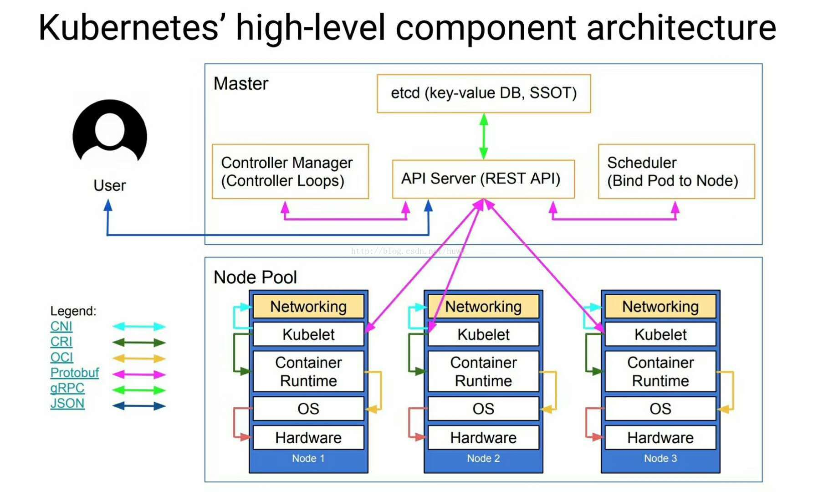

### Kubernetes 架构简介

1、kube-apiserver:  
如果需要与您的 Kubernetes 集群进行交互，就要通过 API。
Kubernetes API 是 Kubernetes 控制平面的前端，用于处理内部和外部请求。
API 服务器会确定请求是否有效，如果有效，则对其进行处理。
您可以通过 REST 调用、kubectl 命令行界面或其他命令行工具（例如 kubeadm）来访问 API。

2、kube-scheduler:  
您的集群是否状况良好？如果需要新的容器，要将它们放在哪里？
这些是 Kubernetes 调度程序所要关注的问题。
调度程序会考虑容器集的资源需求（例如 CPU 或内存）以及集群的运行状况。
随后，它会将容器集安排到适当的计算节点。

3、kube-controller-manager:  
控制器负责实际运行集群，而 Kubernetes 控制器管理器则是将多个控制器功能合而为一。
控制器用于查询调度程序，并确保有正确数量的容器集在运行。
如果有容器集停止运行，另一个控制器会发现并做出响应。
控制器会将服务连接至容器集，以便让请求前往正确的端点。
还有一些控制器用于创建帐户和 API 访问令牌。

4、etcd:  
配置数据以及有关集群状态的信息位于 etcd（一个键值存储数据库）中。
etcd 采用分布式、容错设计，被视为集群的最终事实来源。

5、kubelet:  
每个计算节点中都包含一个 kubelet，这是一个与控制平面通信的微型应用。
kubelet 可确保容器在容器集内运行。
当控制平面需要在节点中执行某个操作时，kubelet 就会执行该操作。

6、kube-proxy:  
每个计算节点中还包含 kube-proxy，这是一个用于优化 Kubernetes 网络服务的网络代理。
kube-proxy 负责处理集群内部或外部的网络通信——靠操作系统的数据包过滤层，或者自行转发流量。

