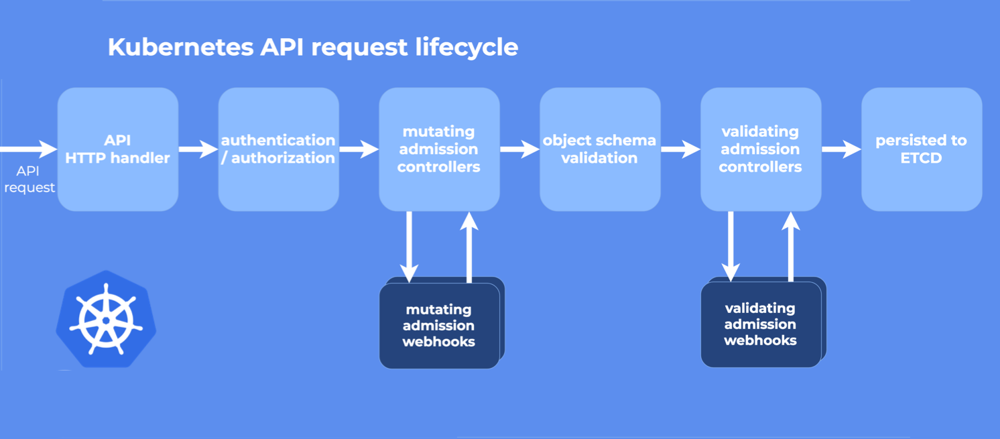

[深入理解 Kubernetes Admission Webhook](https://www.qikqiak.com/post/k8s-admission-webhook/)

1、Validating Admission Webhook <p>
2、Mutating Admission Webhook <p>



---
```shell
向 k8s 集群中注册 Admission Webhook（Validating / Mutating）
```

1）检查 api-server 是否开启 
- MutatingAdmissionWebhook
- ValidatingAdmissionWebhook
```shell
# 获取apiserver pod名字
apiserver_pod_name=`kubectl get --no-headers=true po -n kube-system | grep kube-apiserver | awk '{ print $1 }'`
# 查看api server的启动参数plugin
kubectl get po $apiserver_pod_name -n kube-system -o yaml | grep plugin
```


如果集群没有开启, 则需要开启对应准入控制：
```shell
/etc/kubernetes/manifests/kube-apiserver.yaml

- --enable-admission-plugins=NodeRestriction,MutatingAdmissionWebhook,ValidatingAdmissionWebhook
```

---
###### 参考文档：
https://blog.csdn.net/ll837448792/article/details/118674413

