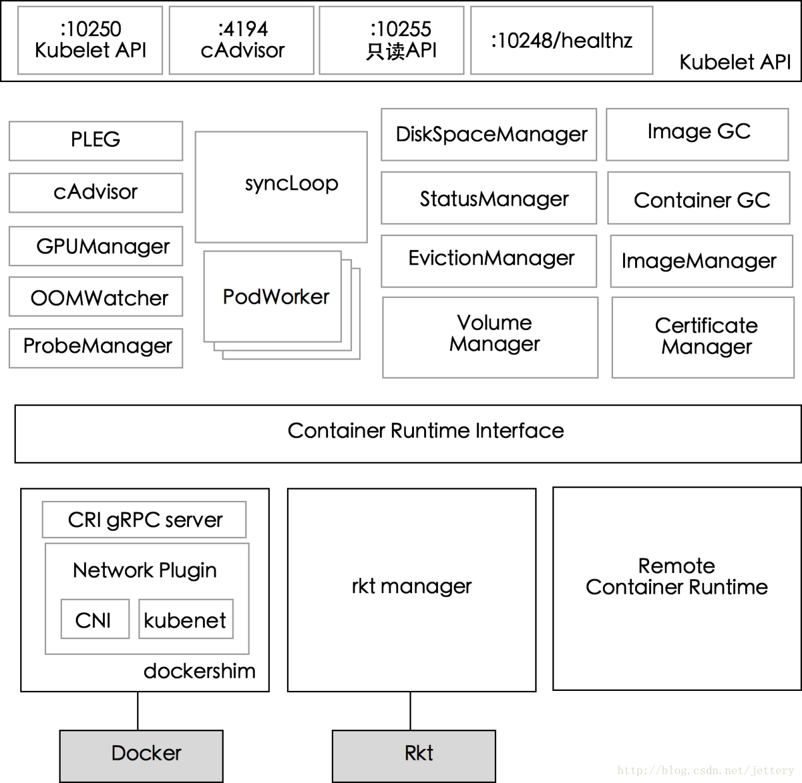

#### kubelet 组件架构图

- PLEG(Pod Lifecycle Event Generator）:   
  PLEG 是 kubelet 的核心模块,PLEG 会一直调用 container runtime 获取本节点 containers/sandboxes 的信息，并与自身维护的 pods cache 信息进行对比，生成对应的 PodLifecycleEvent，然后输出到 eventChannel 中，通过 eventChannel 发送到 kubelet syncLoop 进行消费，然后由 kubelet syncPod 来触发 pod 同步处理过程，最终达到用户的期望状态。

- cAdvisor:  
  cAdvisor（https://github.com/google/cadvisor）是 google 开发的容器监控工具，集成在 kubelet 中，起到收集本节点和容器的监控信息，大部分公司对容器的监控数据都是从 cAdvisor 中获取的 ，cAvisor 模块对外提供了 interface 接口，该接口也被 imageManager，OOMWatcher，containerManager 等所使用。

- OOMWatcher：  
  系统 OOM 的监听器，会与 cadvisor 模块之间建立 SystemOOM,通过 Watch方式从 cadvisor 那里收到的 OOM 信号，并产生相关事件。

- probeManager:   
  probeManager 依赖于 statusManager,livenessManager,containerRefManager，会定时去监控 pod 中容器的健康状况，当前支持两种类型的探针：livenessProbe 和readinessProbe。
  livenessProbe：用于判断容器是否存活，如果探测失败，kubelet 会 kill 掉该容器，并根据容器的重启策略做相应的处理。
  readinessProbe：用于判断容器是否启动完成，将探测成功的容器加入到该 pod 所在 service 的 endpoints 中，反之则移除。readinessProbe 和 livenessProbe 有三种实现方式：http、tcp 以及 cmd。

- statusManager:   
  statusManager 负责维护状态信息，并把 pod 状态更新到 apiserver，但是它并不负责监控 pod 状态的变化，而是提供对应的接口供其他组件调用，比如 probeManager。

- containerRefManager:  
  容器引用的管理，相对简单的Manager，用来报告容器的创建，失败等事件，通过定义 map 来实现了 containerID 与 v1.ObjectReferece 容器引用的映射。

- evictionManager:   
  当节点的内存、磁盘或 inode 等资源不足时，达到了配置的 evict 策略， node 会变为 pressure 状态，此时 kubelet 会按照 qosClass 顺序来驱赶 pod，以此来保证节点的稳定性。可以通过配置 kubelet 启动参数 --eviction-hard= 来决定 evict 的策略值。

- imageGC:  
  imageGC 负责 node 节点的镜像回收，当本地的存放镜像的本地磁盘空间达到某阈值的时候，会触发镜像的回收，删除掉不被 pod 所使用的镜像，回收镜像的阈值可以通过 kubelet 的启动参数 --image-gc-high-threshold 和 --image-gc-low-threshold 来设置。

- containerGC:  
  containerGC 负责清理 node 节点上已消亡的 container，具体的 GC 操作由runtime 来实现。

- imageManager:  
  调用 kubecontainer 提供的PullImage/GetImageRef/ListImages/RemoveImage/ImageStates 方法来保证pod 运行所需要的镜像。

- volumeManager:  
  负责 node 节点上 pod 所使用 volume 的管理，volume 与 pod 的生命周期关联，负责 pod 创建删除过程中 volume 的 mount/umount/attach/detach 流程，kubernetes 采用 volume Plugins 的方式，实现存储卷的挂载等操作，内置几十种存储插件。

- containerManager:  
  负责 node 节点上运行的容器的 cgroup 配置信息，kubelet 启动参数如果指定 --cgroups-per-qos 的时候，kubelet 会启动 goroutine 来周期性的更新 pod 的 cgroup 信息，维护其正确性，该参数默认为 true，实现了 pod 的Guaranteed/BestEffort/Burstable 三种级别的 Qos。

- runtimeManager:  
  containerRuntime 负责 kubelet 与不同的 runtime 实现进行对接，实现对于底层 container 的操作，初始化之后得到的 runtime 实例将会被之前描述的组件所使用。可以通过 kubelet 的启动参数 --container-runtime 来定义是使用docker 还是 rkt，默认是 docker。

- podManager:  
  podManager 提供了接口来存储和访问 pod 的信息，维持 static pod 和 mirror pods 的关系，podManager 会被statusManager/volumeManager/runtimeManager 所调用，podManager 的接口处理流程里面会调用 secretManager 以及 configMapManager。

