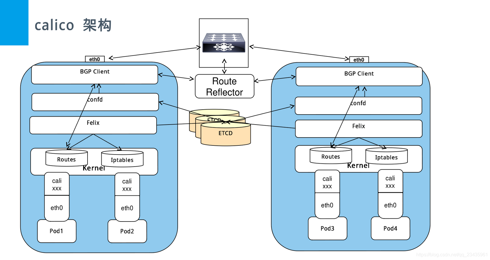

#### calico

1、calico系统结构  


- Felix: 负责管理设置node  
  - 接口管理
  - 路由规则
  - ACL规则
  - 状态报告

- bird: 一个开源的软路由，支持多种路由协议  
  -BGP客户端: Calico在每个节点上的都会部署一个BGP客户端，它的作用是将Felix的路由信息读入内核，并通过BGP协议在集群中分发。当Felix将路由插入到Linux内核FIB中时，BGP客户端将获取这些路由并将它们分发到部署中的其他节点。这可以确保在部署时有效地路由流量。

- BGP Router Reflector:  
  - 大型网络仅仅使用 BGP client 形成 mesh 全网互联的方案就会导致规模限制，所有节点需要 N^2 个连接，为了解决这个规模问题，可以采用 BGP 的 Router Reflector 的方法，使所有 BGP Client 仅与特定 RR 节点互联并做路由同步，从而大大减少连接数。

- Calicoctl: calico 命令行管理工具。

2、Calico 网络模式
- BGP 边界网关协议（Border Gateway Protocol, BGP）
  - 是互联网上一个核心的去中心化自治路由协议。BGP不使用传统的内部网关协议（IGP）的指标。
  
- IPIP模式
  - 把 IP 层封装到 IP 层的一个 tunnel。作用其实基本上就相当于一个基于IP层的网桥！

---
启动文件放在 /opt/cni/bin 目录下，/etc/cni/net.d/10-calico.conflist 目录下记录子网的相关配置信息。
```json
{
  "name": "k8s-pod-network",
  "cniVersion": "0.3.0",
  "plugins": [
    {
      "type": "calico",
      "log_level": "info",
      "etcd_endpoints": "https://10.10.0.174:2379",
      "etcd_key_file": "/etc/cni/net.d/calico-tls/etcd-key",
      "etcd_cert_file": "/etc/cni/net.d/calico-tls/etcd-cert",
      "etcd_ca_cert_file": "/etc/cni/net.d/calico-tls/etcd-ca",
      "mtu": 1440,
      "ipam": {
          "type": "calico-ipam"
      },
      "policy": {
          "type": "k8s"
      },
      "kubernetes": {
          "kubeconfig": "/etc/cni/net.d/calico-kubeconfig"
      }
    },
    {
      "type": "portmap",
      "snat": true,
      "capabilities": {"portMappings": true}
    }
  ]
}
```

3、pod 间访问流程

1）数据包从 Pod1 出到达 Veth Pair另一端（宿主机上，以cali前缀开头）  
2）宿主机根据路由规则，将数据包转发给下一跳（网关）  
3）到达 Node2，根据路由规则将数据包转发给 cali 设备，从而到达 Pod2。  

---
参考文档：  
- [Calico-介绍、原理与使用](https://blog.csdn.net/qq_23435961/article/details/106660196)


