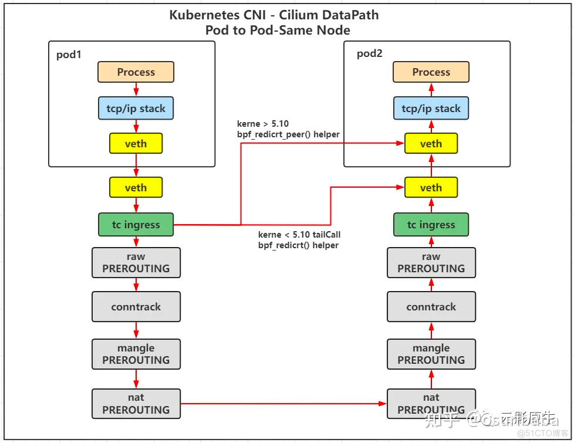

#### cilium 架构


- Cilium Agent
- Cilium Operator

1、组网模式
- Overlay 组网  


- 网络隔离


- L7层访问控制协议扩展原理图


2、Cilium 功能一览  
1）容器的网络连接  
- overlay：基于封装的虚拟网络产生所有主机
- 直接路由：使用 Linux 主机内置或者云提供商的路由表

2）基于策略的网络安全  
- 基于身份
- 基于 IP/CIDR
- 基于 API

3）分布式可扩展负载均衡  
- eBPF 提供高性能 L3/L4 的服务转发和负载均衡
  - rr/wrr/源 hash

4）可视化  
- 网络包
- API

5）监控  
- 周期性的监控集群链接状态
  - 节点延迟
  - 节点失效
  - 底层网络问题

3、Cilium 网络策略
```shell
kind: CiliumNetworkPolicy
```
- TCP 策略
- 基于网段的策略
- HTTP 策略

---
同一个 Node 上的 pod 通信  

- pod1 的 veth --> host veth --> tc ingress --> pod2 veth
- bpf_redirect_peer() --> pod2 veth (同一个 namespace)

不同 Node 上的 pod 通信  

- 通过 cilium_vxlan 的设备，通过 UDP 封包，传输到 pod2 对应的 Host 主机
- 解包之后，传输到对应 pod2 的 veth 中

---
##### 参考文档：
[Cilium 中文指南](https://lib.jimmysong.io/cilium-handbook/)
[基于 ebpf 和 vxlan 实现一个 k8s 网络插件（一）](https://zhuanlan.zhihu.com/p/565254116)