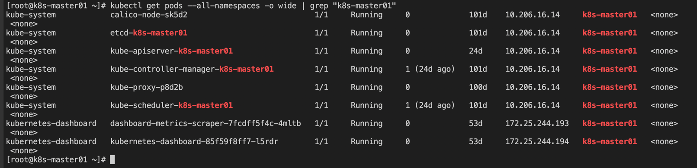

#### 集群 cni 信息

1) 集群信息
```shell
kubectl get node -o wide
```


2) 查看集群部署的 pod 情况
```shell
kubectl get pods --all-namespaces -o wide
```


---
Kubernetes 集群内部存在三类 IP:
- Node IP：宿主机的 IP 地址
- Pod IP：使用网络插件创建的 IP（如 flannel），使跨主机的 Pod 可以互通
- Cluster IP：虚拟 IP，通过 iptables 规则访问服务

---
在安装 node 节点的时候，节点上的进程是按照:
- flannel -> docker -> kubelet -> kube-proxy 的顺序启动的


