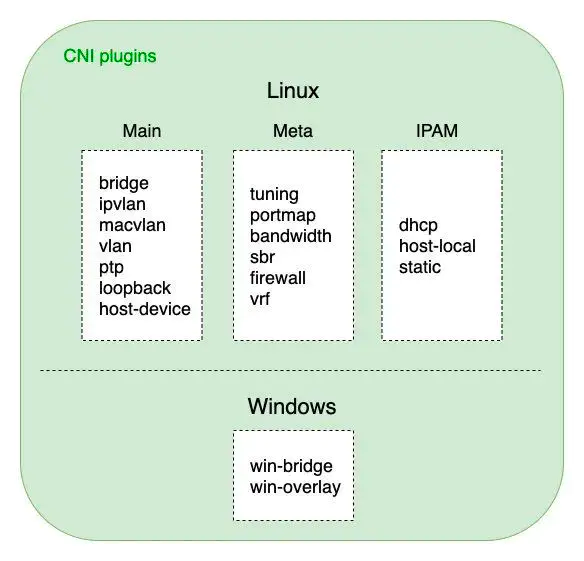

#### CNI（Container Network Interface）

```go
type CNI interface {
    AddNetworkList (net *NetworkConfigList, rt *RuntimeConf) (types.Result, error)
    DelNetworkList (net *NetworkConfigList, rt *RuntimeConf) error
    AddNetwork (net *NetworkConfig, rt *RuntimeConf) (types.Result, error)
    DelNetwork (net *NetworkConfig, rt *RuntimeConf) error
}
```

CNI 常用插件：
- loopback
- Bridge
- PTP
- Macvlan
- IPvlan
- third-party

---
- 二层负载均衡：基于 MAC 地址的二层负载均衡。
- 三层负载均衡：基于 IP 地址的负载均衡。
- 四层负载均衡：基于 IP+端口 的负载均衡。
- 七层负载均衡：基于 URL 等应用层信息的负载均衡。

---
kubelet 要使用 CNI 网络驱动需要配置启动参数： 
- --network-plugin=cni
- --cni-conf-dir (默认为：/etc/cni/net.d)
- --cni-bin-dir (默认为：/opt/cni/bin)

---
1、CNI 网络插件的工作流程  
1）kubelet 通过调用 CRI 接口（RunPodSandbox()） 创建 pause 容器，生成对应的 network namespace  
2）调用网络驱动（driver） --> CNI 的方式 --> 具体的 CNI 插件  
3）CNI 插件给 pause 容器配置正确的网络，Pod 中的其他容器共用 pause 的网络栈

2、CNI 工作原理  
- cni 配置文件目录
- cni 二进制文件

3、cni 解决的问题  
- 容器 IP 地址重复问题
- 容器 IP 地址路由问题

---
CNI 网络插件的开发方式   
- CNI 插件的详细工作流程
1）kubelet 的 grpc-client 调用 CRI grpc-server (dockerd/containerd)，创建一个 pod
2) grpc-server 按照一定的流程去 pull image, 创建 RunPodSandbox(pause), 创建 netns，启动容器，将容器加入 Sandbox()
3) grpc-server 读取主机上 cni 配置（/etc/cni/net.d），获取 cni 的 name
4) 在 （/opt/kubernetes/cni/bin） 下访问 name 的二进制文件，
   grpc-server 传入 containerID, netns，eth-name，pod-name 等参数信息

- CNI 插件开发框架
1) cmdAdd
2) cmdDel

- CNI 设计考量   
1）容器运行时必须在调用任何插件之前为容器创建一个新的网络命名空间   
2）容器运行时必须按顺序为每个网络执行相应的插件，将容器添加到每个网络中   
3）在完成容器生命周期后，运行时必须以相反的顺序执行插件（相对于执行添加容器的顺序）以将容器与网络断开连接   
4）容器运行时不能为同一容器调用并行操作，但可以为不同的容器调用并行操作   
5）容器必须由 ContainerID 唯一标识。存储状态的插件应该使用（网络名称，容器 ID）的主键来完成   
6）运行时不能调用同一个网络名称或容器 ID 执行两次 ADD（没有相应的 DEL）

- CNI 基本插件 

1）ipam：用于管理 ip 和相关网络数据，配置网卡，ip，路由   
2）main: 用于进行网络配置，创建网桥，vethpair, macvlan 等
  - bridge/ipvlan/loopback/macvlan/ptp/vlan
3）meta：用于和第三方 CNI 插件进行适配，flannel，或者配置内核参数 tuning

**将容器添加到网络：**   
- 版本：调用者正在使用的 CNI 规范
- 容器 ID：由容器运行时分配的容器的唯一明文标识符
- 网络命名空间路径：需要添加的网络名称空间的路径（/proc/[pid]/ns/net）
- 网络配置：描述容器可以加入网络的 JSON 文档
- 额外的参数：提供一个替代机制，允许在每个容器上配置 CNI 插件
- 容器内的接口的名称：分配给容器（网络命名空间）内创建的接口名称

-- 结果：
- 接口与列表
- 分配给每个接口的 IP 设置
- DNS 信息
  - nameserver 
  - domain 
  - search domain 
  - option

**从网络中删除容器：**
- 版本
- 容器 ID
- 网络命名空间路径
- 网络配置
- 额外的参数
- 定义的容器接口名称

IP 分配：
- IPAM 插件：接收所有传入 CNI 插件的相同环境变量

可用插件：
- Main：接口创建
  - bridge：创建网桥，并添加主机和容器到该网桥
  - ipvlan：在容器中添加一个 ipvlan 接口
  - loopback：创建一个回环接口
  - macvlan：创建一个新的 mac 地址，将所有的流量转发到容器
  - ptp：创建 veth 对
  - vlan：分配一个 vlan 设备
- IPAM：IP 地址分配
  - dhcp：在主机上运行守护程序，代表容器发出的 dhcp 请求
  - host-local：维护分配 IP 的本地数据库
- Meta：其他插件
  - flannel：根据 flannel 的配置文件创建接口
  - tuning：调整现有接口 sysctl 参数
  - portmap：一个基于 iptables 的 portmapping 插件
  
ptp 网络配置步骤：     
1）从 ipam 获取 IP，根据 ip 类型（ipv4或ipv6）配置响应的内核 ip_forward 参数；
2）创建一对 vethpair，一端放到容器中；  
3）进入容器的网络 namespace，配置容器端的网卡，修改网卡名，配置 IP，并配置一些路由；  
4）退出到容器外，将 vethpair 的node端配置一个 IP；   
5）配置外部的路由：访问容器ip的请求都路由到 vethpair 的node端设备去；   
6）如果 IPMasq=true，配置 iptables；   
7）获取完整的网卡信息（ vethpair 的两端），返回给调用者；

---
参考项目：  
- https://github.com/containernetworking/cni
- https://github.com/y805939188/simple-k8s-cni
- https://www.jianshu.com/p/ce10b77b8678