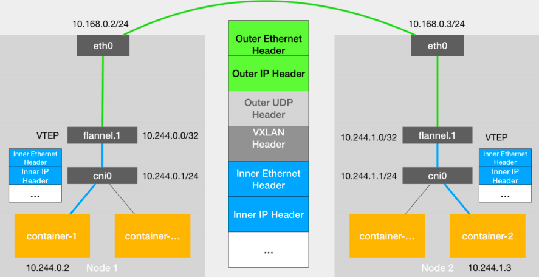
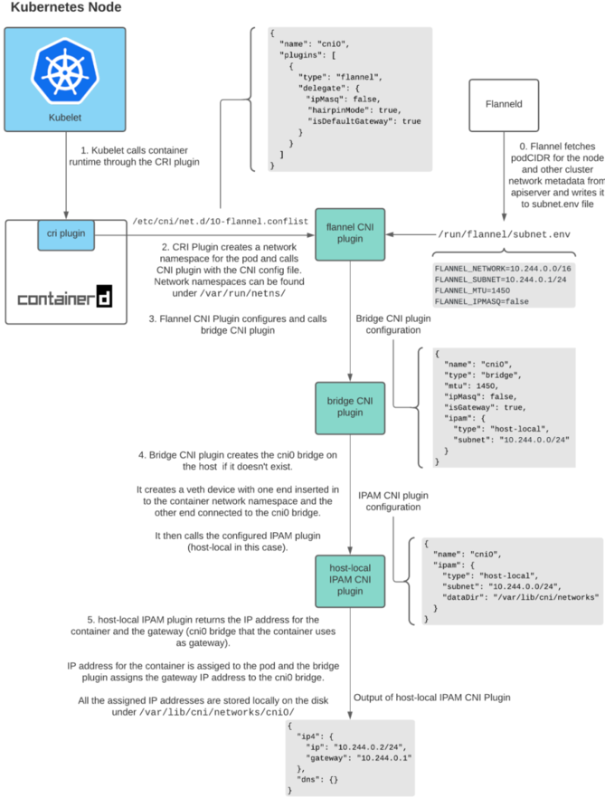
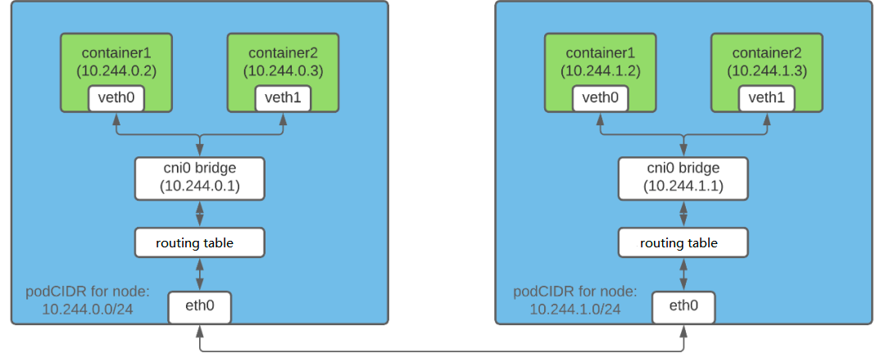
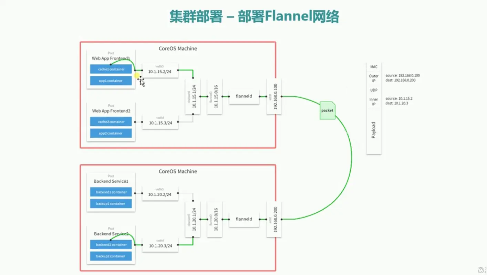

#### Flannel

[Flannel](https://github.com/flannel-io/flannel) 源码

Flannel是一种基于 overlay 网络的跨主机容器网络解决方案，也就是将 TCP 数据包封装在另一种网络包里面进行路由转发和通信。

#### 实现原理

1、网络模式 backend
- UDP （基本弃用）
  - cni0 --> bridge 网桥设备  
  - flannel0 --> tun 虚拟设备  
  - flanneld --> agent (DaemonSet) 网络包的封包和解包
- VxLAN
  - VTEP 的 MAC 地址是通过 APIServer 处 watch Node 发现 
  - flannel.1 (flannel.[VNI])
  - flanneld：将 VTEP 设备相关信息上报到 etcd 中, 当网络中有新节点加入集群中，并向 etcd 注册时：
    - 在节点中创建一条该节点所属网络的路由表 --》 Pod 中的流量路由到 flannel.1 接口 （route -n）
    - 在节点中添加一条该节点 IP 及 VTEP 设备的静态 ARP 缓存 (arp -n) 
- Host-GW
  - 通过容器路由表 IP 到 cni0
  - 到达 cni0 的 IP 包匹配到 HostA 中的路由规则 --> Host B
  - IP 包通过物理网络到达 Host B 中的 eth1
  - 到达 eth1 中的 IP 包匹配到 Host B 中的路由表项， IP 包转发到 cni0
  - cni0 将 IP 包转发给链接在 cni0 上的目的容器

- VxLAN 模式


1）创建 VXLAN 设备，不再监听任何 l2 miss/l3 miss 事件消息  
2）为远端的子网创建路由  
3）为远端的主机创建静态 ARP 表项  
4）创建 FDB 表项， 包括 VTEP MAC 和远端 Flannel 对外 IP  

不同节点之间的通信：

1、pod中的数据，根据pod的路由信息，发送到网桥 cni0
2、cni0 根据节点路由表，将数据发送到隧道设备flannel.1
3、flannel.1 查看数据包的目的ip，从flanneld获取对端隧道设备的必要信息，封装数据包
4、flannel.1 将数据包发送到对端设备。对端节点的网卡接收到数据包，发现数据包为overlay数据包，解开外层封装，并发送内层封装到flannel.1 设备
5、flannel.1 设备查看数据包，根据路由表匹配，将数据发送给cni0设备
6、cni0匹配路由表，发送数据到网桥



- Host-GW 模式


host-gw采用纯静态路由的方式，要求所有宿主机都在一个局域网内，跨局域网无法进行路由。

---
Flannel 使用 etcd 存放网络配置、已分配 的 subnet、host 的 IP 等信息；  

2、数据转发流程


- 1）容器直接使用目标容器的 IP 进行访问，默认通过容器内部的 eth0 发送出去；
- 2）报文通过 veth pair 被发送到 vethXXX；
- 3）vethXXX 是直接连接到虚拟交换机 docker0 的，报文通过虚拟 bridge docker0 发送出去；
- 4）查找路由表，外部容器 ip 的报文都会转发到 flannel0 虚拟网卡，这是一个 P2P 的虚拟网卡，然后报文就被转发到监听在另一端的 flanneld；
- 5）flanneld 通过 etcd 维护了各个节点之间的路由表，把原来的报文 UDP 封装一层，通过配置的 iface 发送出去；
- 6）报文通过主机之间的网络找到目标主机；
- 7）报文继续往上，到传输层，交给监听在 8285 端口的 flanneld 程序处理；
- 8）数据被解包，然后发送给 flannel0 虚拟网卡；
- 9）查找路由表，发现对应容器的报文要交给 docker0；
- 10）docker0 找到连到自己的容器，把报文发送过去；

3、Flannel 启动  
1）先于 Docker 启动  
2）从 etcd 中获取 network（大网）的配置信息
3）划分 subnet（子网），并在 etcd 中进行注册  
4）将子网信息记录到 flannel 维护的 /run/flannel/subnet.env 文件中  
```shell
Flannel_NETWORK=10.0.0.0/16
Flannel_SUBNET=10.0.34.1/24
Flannel_MTU=1472
Flannel_IPMASQ=false
```
5）将 subnet.env 转写成一个 Docker 的环境变量文件 /run/flannel/docker
```shell
DOCKER_OPT_BIP="-bip=10.0.34.1/24"
DOCKER_OPT_IPMASQ="--ip-masq=true"
DOCKER_OPT_MTU="--mtu=1472"
DOCKER_NETWORK_OPTIONS="--bip=10.0.34.1/24 --ip-masq=true --mtu=1472"
```


