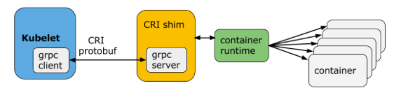

#### CRI（Container Runtime Interface）

```go
type RuntimeService interface {
	RunPodSandbox()
}
```

CRI 主要分为三部分：
- CRI Client
- CRI Server
- OCI （Open Container Initiative） Runtime
  - runc：OCI 标准的参考实现，直接依赖 cgroup/namespace kernel 等进行交互，
    负责为容器配置 cgroup/namespace 等启动容器所需的环境，创建容器启动的相关进程

---
Docker 的架构调整：

Docker Engine --> containerd  
--> containerd-shim --> runC
--> containerd-shim --> runC

kubelet <-- CRI <--> CRI-containerd <--> containerd --> container

cri-o：cri 和 oci 之间的一座桥梁

---
1) CRI 架构   
Container Runtime 实现了 CRI gRPC server：
- RuntimeService：容器和 Sandbox 运行时管理
- ImageService：提供了从镜像仓库拉取、查看和 移除镜像的 RPC


2) 支持 CRI 后端   
- cri-o：kubernetes 的 CRI 标准实现，并且允许 kubernetes 间使用 OCI 兼容的容器运行时
- cri-containerd：基于 containerd 的 kubernetes CRI 实现
- rkt：由 CoreOS 主推的用来跟 docker 抗衡的容器运行时
- docker：kubernetes 最初支持的容器运行时


