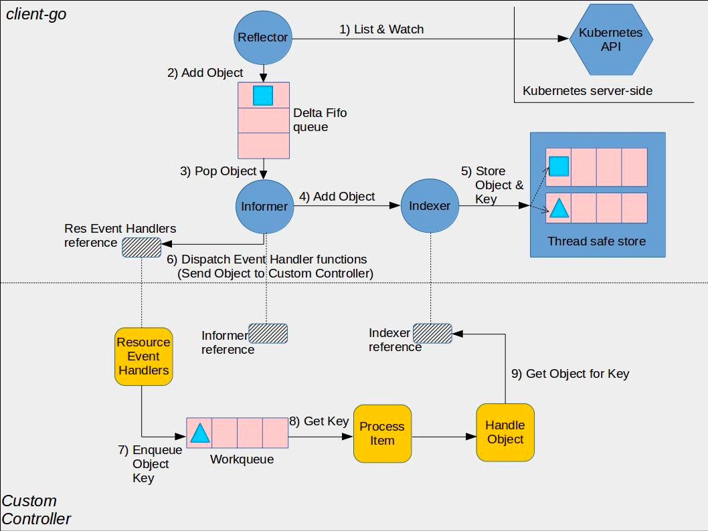
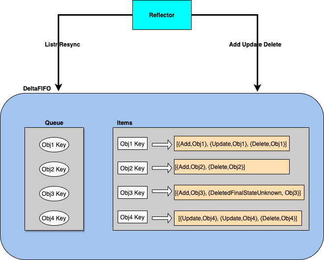
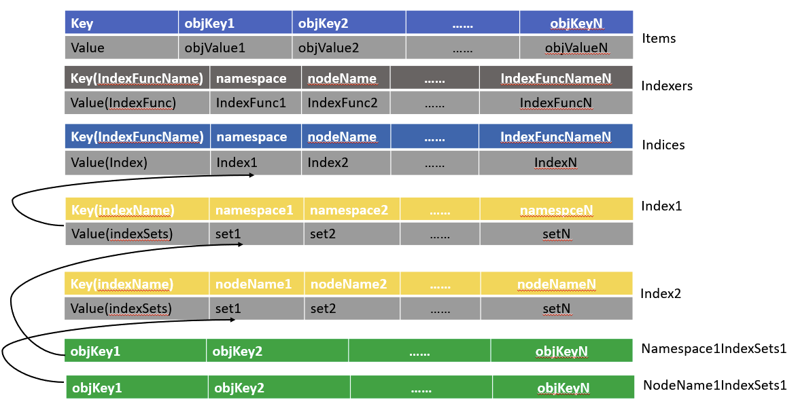

#### client-go 中的 informer 源码分析
client-go informer:


kubernetes提供了client-go以方便使用go语言进行二次快发

##### 1、informerFactory   
- 用来管理需要多少个对象的 informer 实例

```go
// 创建一个 informer factory
kubeInformerFactory := kubeinformers.NewSharedInformerFactory(kubeClient, time.Second*30)

// factory 已经为所有 k8s 的内置资源对象提供了创建对应 informer 实例的方法，调用具体 informer 实例的 Lister 或 Informer 方法
// 就完成了将 informer 注册到 factory 的过程
deploymentLister := kubeInformerFactory.Apps().V1().Deployments().Lister()

// 启动注册到 factory 的所有 informer
kubeInformerFactory.Start(stopCh)
```

##### 2、SharedInformerFactory 结构
- 统一管理控制器中需要的各资源对象的 informer 实例

```go
type sharedInformerFactory struct {
   client           kubernetes.Interface    // clientset
   namespace        string                  // 关注的 namespace，可以通过 WithNamespace Option 配置
   tweakListOptions internalinterfaces.TweakListOptionsFunc
   lock             sync.Mutex
   defaultResync    time.Duration                               //前面传过来的时间，如30s
   customResync     map[reflect.Type]time.Duration              //自定义resync时间
   informers        map[reflect.Type]cache.SharedIndexInformer  //针对每种类型资源存储一个informer，informer的类型是ShareIndexInformer
   startedInformers map[reflect.Type]bool                       //每个informer是否都启动了
}
```

- client: clientset 客户端
- namespace: factory 关注的命名空间（默认： All Namespace）
- defaultResync: 用于初始化持有的 shareIndexInformer 的 resyncCheckPeriod 和 defaultEventHandlerResyncPeriod 字段，
  用于定时的将 local store（Indexer） 同步到 deltaFIFO
- customResync: 支持针对每一个 informer 来配置 resync 时间,
  通过 WithCustomResyncConfig 这个 Option 配置，否则就用指定的 defaultResync
- informers: factory 管理的 informer 集合
- startedInformers: 记录已经启动的 informer 集合

1) 新建一个 sharedInformerFactory
```go
func NewSharedInformerFactoryWithOptions(client kubernetes.Interface, defaultResync time.Duration, options ...SharedInformerOption) SharedInformerFactory {
   factory := &sharedInformerFactory{
      client:           client,          //clientset，对原生资源来说，这里可以直接使用kube clientset
      namespace:        v1.NamespaceAll, //可以看到默认是监听所有ns下的指定资源
      defaultResync:    defaultResync,   //30s
      //以下初始化map结构
      informers:        make(map[reflect.Type]cache.SharedIndexInformer),
      startedInformers: make(map[reflect.Type]bool),
      customResync:     make(map[reflect.Type]time.Duration),
   }
   return factory
}
```
2) 启动 factory 下的所有 informer
```go
func (f *sharedInformerFactory) Start(stopCh <-chan struct{}) {
   f.lock.Lock()
   defer f.lock.Unlock()

   for informerType, informer := range f.informers {
      if !f.startedInformers[informerType] {
         //直接起gorouting调用informer的Run方法，并且标记对应的informer已经启动
         go informer.Run(stopCh)
         f.startedInformers[informerType] = true
      }
   }
}
```

3) 等待 informer 的 cache 被同步
- sharedInformerFactory 的 WaitForCacheSync() 将会不断调用 factory 持有的所有 informer 的 HasSynced() 方法，直到返回 true
- informer 的 HasSynced() 方法调用的自己持有的 controller 的 HasSynced() 方法
（informer 结构持有 controller 对象，下文会分析 informer 的结构）
- informer 中的 controller 的 HasSynced() 方法则调用的是 controller 持有的 deltaFIFO 对象的 HasSynced() 方法

```go
func (f *sharedInformerFactory) WaitForCacheSync(stopCh <-chan struct{}) map[reflect.Type]bool {}
```

4) factory 为自己添加 informer
```go
func (f *sharedInformerFactory) InformerFor(obj runtime.Object, newFunc internalinterfaces.NewInformerFunc) cache.SharedIndexInformer {}
```
根据对象的类型，返回已经实现的 informer

5) shareIndexInformer 对应的 newFunc 的实现
- client-go 中已经为所有内置对象都提供了 NewInformerFunc()

- pod  
  factory.Core().V1().Pods() 为 factory 添加一个 pod 对应的 shareIndexInformer 的实现
- deployment  
  factory.Apps().V1().Deployments() 为 factory 添加一个 pod 对应的 shareIndexInformer 的实现

##### 3、shareIndexInformer 结构

```go
type sharedIndexInformer struct {
   indexer    Indexer       //informer中的底层缓存cache
   controller Controller    //持有reflector和deltaFIFO对象，reflector对象将会listWatch对象添加到deltaFIFO，同时更新indexer cahce，更新成功则通过sharedProcessor触发用户配置的Eventhandler

   processor             *sharedProcessor //持有一系列的listener，每个listener对应用户的EventHandler
   cacheMutationDetector MutationDetector //可以先忽略，这个对象可以用来监测local cache是否被外部直接修改

   // This block is tracked to handle late initialization of the controller
   listerWatcher ListerWatcher //deployment的listWatch方法
   objectType    runtime.Object

   // resyncCheckPeriod is how often we want the reflector's resync timer to fire so it can call
   // shouldResync to check if any of our listeners need a resync.
   resyncCheckPeriod time.Duration
   // defaultEventHandlerResyncPeriod is the default resync period for any handlers added via
   // AddEventHandler (i.e. they don't specify one and just want to use the shared informer's default
   // value).
   defaultEventHandlerResyncPeriod time.Duration
   // clock allows for testability
   clock clock.Clock

   started, stopped bool
   startedLock      sync.Mutex

   // blockDeltas gives a way to stop all event distribution so that a late event handler
   // can safely join the shared informer.
   blockDeltas sync.Mutex
}
```

- indexer: 底层缓存，其实就是一个 map 记录对象
- controller: informer 内部 一个 controller
- reflector: 根据用户定义的 ListWatch() 方法获取对象并更新增量队列 DeltaFIFO
- processor: 知道如何处理 DeltaFIFO 队列中的对象，实现是 sharedProcessor{}
- listerWatcher: 知道如何 list 对象和 watch 对象的方法
- objectType: pod{}/deployment{}
- resyncCheckPeriod: 给自己的 controller 的 reflector 每隔多少s<尝试>调用 listener 的 shouldResync() 方法
- defaultEventHandlerResyncPeriod: 通过 AddEventHandler() 方法给 informer 配置回调时如果没有配置的默认值，
  这个值用在 processor 的 listener 中判断是否需要进行 resync，最小1s

1) sharedIndexInformer 的 Run() 方法
```go
// k8s.io/client-go/tools/cache/shared_informer.go
func (s *sharedIndexInformer) Run(stopCh <-chan struct{}) {}
```

2) 为 shareIndexInformer 创建 controller
- 通过执行 reflector.Run() 方法启动 reflector，开启对指定对象的 listAndWatch() 过程，获取的对象将添加到 reflector 的 deltaFIFO 中
- 通过不断执行 processLoop() 方法，从 DeltaFIFO pop 出对象，再调用 reflector 的 Process（就是shareIndexInformer的HandleDeltas方法）处理

3) controller 的 processLoop() 方法

```go
func (c *controller) processLoop() {
   for {
      obj, err := c.config.Queue.Pop(PopProcessFunc(c.config.Process))
      if err != nil {
         if err == ErrFIFOClosed {
            return
         }
         if c.config.RetryOnError {
            // This is the safe way to re-enqueue.
            c.config.Queue.AddIfNotPresent(obj)
         }
      }
   }
}
```

4) deltaFIFO pop 出来的对象处理逻辑

sharedIndexInformer 的 HandleDeltas 处理从 deltaFIFO pod 出来的增量时, 先尝试更新到本地缓存 cache,
更新成功的话会调用 processor.distribute() 方法向 processor 中的 listener 添加 notification，
listener 启动之后会不断获取 notification 回调用户的 EventHandler 方法

- Sync: reflector list 到对象时 Replace 到 deltaFIFO 时 daltaType 为 Sync 或者 resync 把 local strore 中的对象加回到 deltaFIFO
- Added、Updated: reflector watch 到对象时根据 watch event type 是 Add 还是 Modify 对应 deltaType 为 Added 或者 Updated
- Deleted: reflector watch 到对象的 watch event type 是 Delete 或者 re-list Replace 到 deltaFIFO 时 local store 多出的对象以 Delete 的方式加入 deltaFIFO

```go
// k8s.io/client-go/tools/cache/shared_informer.go
func (s *sharedIndexInformer) HandleDeltas(obj interface{}) error {}
```

5) reflector.run() 发起 ListWatch   
- 什么时候可能发生 re-list 或者 re-watch   
  通过 wait.Util() 不断调用 ListAndWatch() 方法，所以只要该方法 return 了，那么就会发生 re-list

- 以 ResourceVersion=0 开始首次的 List 操作获取指定资源的全量对象，并通过 reflector 的 syncWith() 方法将所有对象批量插入 deltaFIFO
- List 完成之后将会更新 ResourceVersion 用户 Watch 操作，通过 reflector 的 watchHandler 方法把 watch 到的增量对象加入到 deltaFIFO

```go
// k8s.io/client-go/tools/cache/reflector.go
func (r *Reflector) ListAndWatch(stopCh <-chan struct{}) error {}
```

6) list 出的对象批量插入 deltaFIFO
- syncWith() 方法是通过调用 deltaFIFO 的 Replace 实现批量插入

```go
func (r *Reflector) syncWith(items []runtime.Object, resourceVersion string) error {
    found := make([]interface{}, 0, len(items))
    for _, item := range items {
        found = append(found, item)
    }
    return r.store.Replace(found, resourceVersion)
}
```

7) watch 出的增量对象插入到 deltaFIFO
- watch 到的对象直接根据 watch 到的事件类型 eventType 更新 store（即 deltaFIFO），注意这个 event 是 api 直接返回的，
  watch event type 可能是 Added、Modifyed、Deleted

```go
// k8s.io/client-go/tools/cache/reflector.go
// watchHandler watches w and sets setLastSyncResourceVersion
func watchHandler(start time.Time,
    w watch.Interface,
    store Store,
    expectedType reflect.Type,
    expectedGVK *schema.GroupVersionKind,
    name string,
    expectedTypeName string,
    setLastSyncResourceVersion func(string),
    clock clock.Clock,
    errc chan error,
    stopCh <-chan struct{},
) error {}
```

8) 定时触发 resync
- 在 ListAndWatch() 中还起了一个 gorouting 定时的进行 resync 动作
- 调用 deltaFIFO 的 Resync() 方法，把底层缓存的对象全部重新添加到 deltaFIFO 中

##### 4、底层缓存的实现
shareIndexInformer 中带有一个缓存 indexer，是一个支持索引的 map，优点是支持快速查询

- Indexer、Queue 接口和 cache 结构体都实现了顶层的Store接口
- cache 结构体持有 threadSafeStore 对象

1) threadSafeMap 结构

```go
type threadSafeMap struct {
   lock  sync.RWMutex
   items map[string]interface{}

   // indexers maps a name to an IndexFunc
   indexers Indexers
   // indices maps a name to an Index
   indices Indices
}

// Indexers maps a name to a IndexFunc
type Indexers map[string]IndexFunc

// Indices maps a name to an Index
type Indices map[string]Index
type Index map[string]sets.String
```

- items: 存储具体的对象
- Indexers: 一个 map[string]IndexFunc 结构，其中 key 为索引的名称
- Indices: 一个 map[string]Index 结构，其中 key 也是索引的名称，value 是一个 map[string]sets.String 结构

2) 索引的维护
- 遍历所有的 Indexers 中的索引函数，根据索引函数存储索引 key 到 value 的集合关系



3) 缓存中增加对象
- 在向 threadSafeMap 的 items map 中增加完对象后，再通过 updateIndices 更新索引结构

4) IndexFunc 索引函数
- MetaNamespaceIndexFunc()：根据 namespace 获取该 namespace 下的所有对象

```go
// MetaNamespaceIndexFunc is a default index function that indexes based on an object's namespace
func MetaNamespaceIndexFunc(obj interface{}) ([]string, error) {
   meta, err := meta.Accessor(obj)
   if err != nil {
      return []string{""}, fmt.Errorf("object has no meta: %v", err)
   }
   return []string{meta.GetNamespace()}, nil
}
```

5) Index 方法利用索引查找对象
- Index 方法可以根据索引名称和对象，查询所有的关联对象

```go
func (c *threadSafeMap) Index(indexName string, obj interface{}) ([]interface{}, error) {}
```

##### 5、deltaFIFO 实现
shareIndexInformer.controller.reflector 中的 deltaFIFO 实现

```go
type DeltaFIFO struct {
   // lock/cond protects access to 'items' and 'queue'.
   lock sync.RWMutex
   cond sync.Cond

   // We depend on the property that items in the set are in
   // the queue and vice versa, and that all Deltas in this
   // map have at least one Delta.
   // 这里的Deltas是[]Delta类型
   items map[string]Deltas
   queue []string

   // populated is true if the first batch of items inserted by Replace() has been populated
   // or Delete/Add/Update was called first.
   populated bool
   // initialPopulationCount is the number of items inserted by the first call of Replace()
   initialPopulationCount int

   // keyFunc is used to make the key used for queued item
   // insertion and retrieval, and should be deterministic.
   keyFunc KeyFunc

   // knownObjects list keys that are "known", for the
   // purpose of figuring out which items have been deleted
   // when Replace() or Delete() is called.
   // 这个其实就是shareIndexInformer中的indexer底层缓存的引用
   knownObjects KeyListerGetter

   // Indication the queue is closed.
   // Used to indicate a queue is closed so a control loop can exit when a queue is empty.
   // Currently, not used to gate any of CRED operations.
   closed     bool
   closedLock sync.Mutex
}

type Delta struct {
   Type   DeltaType
   Object interface{}
}

// Deltas is a list of one or more 'Delta's to an individual object.
// The oldest delta is at index 0, the newest delta is the last one.
type Deltas []Delta
```

- items: 记录 deltaFIFO 中的对象，注意 map 的 value 是一个 delta slice
- queue: 记录上面 items 中的 key，维护对象的 fifo 顺序
- populated: 队列中是否填充过数据，LIST 时调用 Replace 或调用 Delete/Add/Update 都会置为 true
- initialPopulationCount: 首次 List 的时候获取到的数据就会调用 Replace 批量增加到队列，
  同时设置 initialPopulationCount 为 List 到的对象数量，每次 Pop 出来会减一，用于判断是否把首次批量插入的数据都 POP 出去了
- keyFunc: 知道怎么从对象中解析出对应 key 的函数
- knownObjects: shareIndexInformer 中的 indexer 底层缓存的引用，可以认为和 etcd 中的数据一致

1) 向 deltaFIFO 批量插入对象
- 批量向队列插入数据的方法，注意 knownObjects 是 informer 中本地缓存 indexer 的引用

```go
// k8s.io/client-go/tools/cache/delta_fifo.go
func (f *DeltaFIFO) Replace(list []interface{}, resourceVersion string) error {}
```

2) 从 deltaFIFO pop 出对象
- 从队列中 Pop 出一个方法，并由函数 process() 来处理，其实就是 shareIndexInformer 的 HandleDeltas

```go
// k8s.io/client-go/tools/cache/delta_fifo.go
func (f *DeltaFIFO) Pop(process PopProcessFunc) (interface{}, error) {}
```

3) deltaFIFO 是否同步完成
- factory 的 WaitForCacheSync() 方法调用 informer 的 HasSync() 方法，继而调用 deltaFIFO 的 HasSync() 方法，也就是判断从 reflector list 到的数据是否 pop 完

```go
func (f *DeltaFIFO) HasSynced() bool {
   f.lock.Lock()
   defer f.lock.Unlock()
   return f.populated && f.initialPopulationCount == 0
}
```

4) 同步 local store 到 deltaFIFO
- resync，其实就是把 knownObjects 即缓存中的对象全部再通过 queueActionLocked(Sync, obj) 加到队列

```go
// k8s.io/client-go/tools/cache/delta_fifo.go
func (f *DeltaFIFO) Resync() error {}
```

5) 在 deltaFIFO 增加一个对象
- 在append增量时的去重逻辑
- 连续的两个增量类型都是 Deleted，那么就去掉一个

```go
// k8s.io/client-go/tools/cache/delta_fifo.go
func (f *DeltaFIFO) queueActionLocked(actionType DeltaType, obj interface{}) error {}
```

##### 6、sharedProcessor 的实现
shareIndexInformer 中的 sharedProcess 结构，用于分发 deltaFIFO 的对象，回调用户配置的 EventHandler 方法

```go
type sharedProcessor struct {
   listenersStarted bool
   listenersLock    sync.RWMutex
   listeners        []*processorListener
   syncingListeners []*processorListener
   clock            clock.Clock
   wg               wait.Group
}
```

- listenersStarted: listeners 中包含的 listener 是否都已经启动了
- listeners: 已添加的 listener 列表，用来处理 watch 到的数据
- syncingListeners: 已添加的 listener 列表，用来处理 list 或者 resync 的数据

1) 理解 listeners 和 syncingListeners 的区别
- processor 可以支持 listener 的维度配置是否需要 resync
- syncingListeners 是 listeners的子集

2) 为 sharedProcessor 添加 listener
- 在 sharedProcessor 中添加一个 listener

```go
func (p *sharedProcessor) addListenerLocked(listener *processorListener) {
   // 同时添加到listeners和syncingListeners列表，但其实添加的是同一个对象的引用
   // 所以下面run启动的时候只需要启动listeners中listener就可以了
   p.listeners = append(p.listeners, listener)
   p.syncingListeners = append(p.syncingListeners, listener)
}
```

3) 启动 sharedProcessor 中的 listener
- sharedProcessor 启动所有的 listener 是通过调用 listener.run() 和 listener.pop() 来启动一个 listener

```go
func (p *sharedProcessor) run(stopCh <-chan struct{}) {
   func() {
      p.listenersLock.RLock()
      defer p.listenersLock.RUnlock()
      for _, listener := range p.listeners {
        // listener的run方法不断的从listener自身的缓冲区取出对象回调handler
         p.wg.Start(listener.run)
        // listener的pod方法不断的接收对象并暂存在自身的缓冲区中
         p.wg.Start(listener.pop)
      }
      p.listenersStarted = true
   }()
   <-stopCh
   p.listenersLock.RLock()
   defer p.listenersLock.RUnlock()
   for _, listener := range p.listeners {
      close(listener.addCh) // Tell .pop() to stop. .pop() will tell .run() to stop
   }
   p.wg.Wait() // Wait for all .pop() and .run() to stop
}
```

4) sharedProcessor 分发对象
- 当通过 distribute 分发从 deltaFIFO 获取的对象时，如果 delta type 是 Sync，那么就会把对象交给 sync listener 来处理
- Sync 类型的 delta 只能来源于下面两种情况:
  - reflector list Replace 到 deltaFIFO 的对象：因为首次在 sharedProcessor 增加一个 listener 的时候是同时加在 listeners 和 syncingListeners 中的
  - reflector 定时触发 resync local store 到 deltaFIFO 的对象：因为每次 reflector 调用 processor 的 shouldResync 时，都会把达到 resync 条件的 listener 筛选出来重新放到 p.syncingListeners

```go
func (p *sharedProcessor) distribute(obj interface{}, sync bool) {
   p.listenersLock.RLock()
   defer p.listenersLock.RUnlock()
   // 如果是通过reflector list Replace到deltaFIFO的对象或者reflector定时触发resync到deltaFIFO的对象，那么distribute到syncingListeners
   if sync {
     // 保证deltaFIFO Resync方法过来的delta obj只给开启了resync能力的listener
      for _, listener := range p.syncingListeners {
         listener.add(obj)
      }
   } else {
      for _, listener := range p.listeners {
         listener.add(obj)
      }
   }
}
```

5) processorListener 结构
- processorListener 是 sharedIndexInformer 调用 AddEventHandler() 时创建并添加到 sharedProcessor，
- 对于一个 Informer，可以多次调用 AddEventHandler 来添加多个 listener

```go
type processorListener struct {
   nextCh chan interface{}
   addCh  chan interface{}

   handler ResourceEventHandler

   // pendingNotifications is an unbounded ring buffer that holds all notifications not yet distributed.
   // There is one per listener, but a failing/stalled listener will have infinite pendingNotifications
   // added until we OOM.
   // TODO: This is no worse than before, since reflectors were backed by unbounded DeltaFIFOs, but
   // we should try to do something better.
   pendingNotifications buffer.RingGrowing

   // requestedResyncPeriod is how frequently the listener wants a full resync from the shared informer
   requestedResyncPeriod time.Duration
   // resyncPeriod is how frequently the listener wants a full resync from the shared informer. This
   // value may differ from requestedResyncPeriod if the shared informer adjusts it to align with the
   // informer's overall resync check period.
   resyncPeriod time.Duration
   // nextResync is the earliest time the listener should get a full resync
   nextResync time.Time
   // resyncLock guards access to resyncPeriod and nextResync
   resyncLock sync.Mutex
}
```

- addCh: 无缓冲的 channel, listener 的 pod 方法不断从 addCh 取出对象丢给 nextCh
  addCh 中的对象来源于 listener 的 add 方法，如果 nextCh 不能及时消费，则放入缓冲区 pendingNotifications
- nextCh: 无缓冲的 channel，listener 的 run 方法不断从 nextCh 取出对象回调用户 handler
  nextCh 的对象来源于 addCh 或者缓冲区
- pendingNotifications: 一个无容量限制的环形缓冲区，可以理解为可以无限存储的队列，用来存储 deltaFIFO 分发过来的消息
- nextResync: 由 resyncPeriod 和 requestedResyncPeriod 计算得出，与当前时间 now 比较判断 listener 是否该进行 resync 了
- resyncPeriod: listener 自身期待多长时间进行 resync
- requestedResyncPeriod: informer 希望 listener 多长时间进行 resync

6) 在 listener 中添加事件
- shareProcessor 中的 distribute() 方法调用的是 listener 的 add 来向 addCh 增加消息，注意 addCh 是无缓冲的 channel，依赖 pop 不断从 addCh 取出数据

```go
func (p *processorListener) add(notification interface{}) {
  // 虽然p.addCh是一个无缓冲的channel，但是因为listener中存在ring buffer，所以这里并不会一直阻塞
   p.addCh <- notification
}
```

7) 判断是否需要 resync
- 如果 resyncPeriod 为 0 表示不需要 resync，否则判断当前时间 now 是否已经超过了 nextResync，是的话则返回 true 表示需要 resync

```go
// k8s.io/client-go/tools/cache/shared_informer.go
func (p *sharedProcessor) shouldResync() bool {}

```

8) listener 的 run 方法回调 EventHandler
- listener 的 run 方法不断的从 nextCh 中获取 notification，并根据 notification 的类型来调用用户自定的 EventHandler

```go
func (p *processorListener) run() {
   // this call blocks until the channel is closed.  When a panic happens during the notification
   // we will catch it, **the offending item will be skipped!**, and after a short delay (one second)
   // the next notification will be attempted.  This is usually better than the alternative of never
   // delivering again.
   stopCh := make(chan struct{})
   wait.Until(func() {
      // this gives us a few quick retries before a long pause and then a few more quick retries
      err := wait.ExponentialBackoff(retry.DefaultRetry, func() (bool, error) {
         for next := range p.nextCh {
            switch notification := next.(type) {
            case updateNotification:
              // 回调用户配置的handler
               p.handler.OnUpdate(notification.oldObj, notification.newObj)
            case addNotification:
               p.handler.OnAdd(notification.newObj)
            case deleteNotification:
               p.handler.OnDelete(notification.oldObj)
            default:
               utilruntime.HandleError(fmt.Errorf("unrecognized notification: %T", next))
            }
         }
         // the only way to get here is if the p.nextCh is empty and closed
         return true, nil
      })

      // the only way to get here is if the p.nextCh is empty and closed
      if err == nil {
         close(stopCh)
      }
   }, 1*time.Minute, stopCh)
}
```

9) addCh 到 nextCh 的对象传递
- listener 中 pop 方法的逻辑相对比较绕，最终目的就是把分发到 addCh 的数据从 nextCh 或者 pendingNotifications 取出来

```go
func (p *processorListener) pop() {
   defer utilruntime.HandleCrash()
   defer close(p.nextCh) // Tell .run() to stop

   //nextCh没有利用make初始化，将阻塞在读和写上
   var nextCh chan<- interface{}
   //notification初始值为nil
   var notification interface{}
   for {
      select {
      // 执行这个case，相当于给p.nextCh添加来自p.addCh的内容
      case nextCh <- notification:
         // Notification dispatched
         var ok bool
         //前面的notification已经加到p.nextCh了， 为下一次这个case再次ready做准备
         notification, ok = p.pendingNotifications.ReadOne()
         if !ok { // Nothing to pop
            nextCh = nil // Disable this select case
         }
      //第一次select只有这个case ready
      case notificationToAdd, ok := <-p.addCh:
         if !ok {
            return
         }
         if notification == nil { // No notification to pop (and pendingNotifications is empty)
            // Optimize the case - skip adding to pendingNotifications
            //为notification赋值
            notification = notificationToAdd
            //唤醒第一个case
            nextCh = p.nextCh
         } else { // There is already a notification waiting to be dispatched
            //select没有命中第一个case，那么notification就没有被消耗，那么把从p.addCh获取的对象加到缓存中
            p.pendingNotifications.WriteOne(notificationToAdd)
         }
      }
   }
}
```

---
---

**参考文档：**   
1) https://jimmysong.io/kubernetes-handbook/develop/client-go-informer-sourcecode-analyse.html