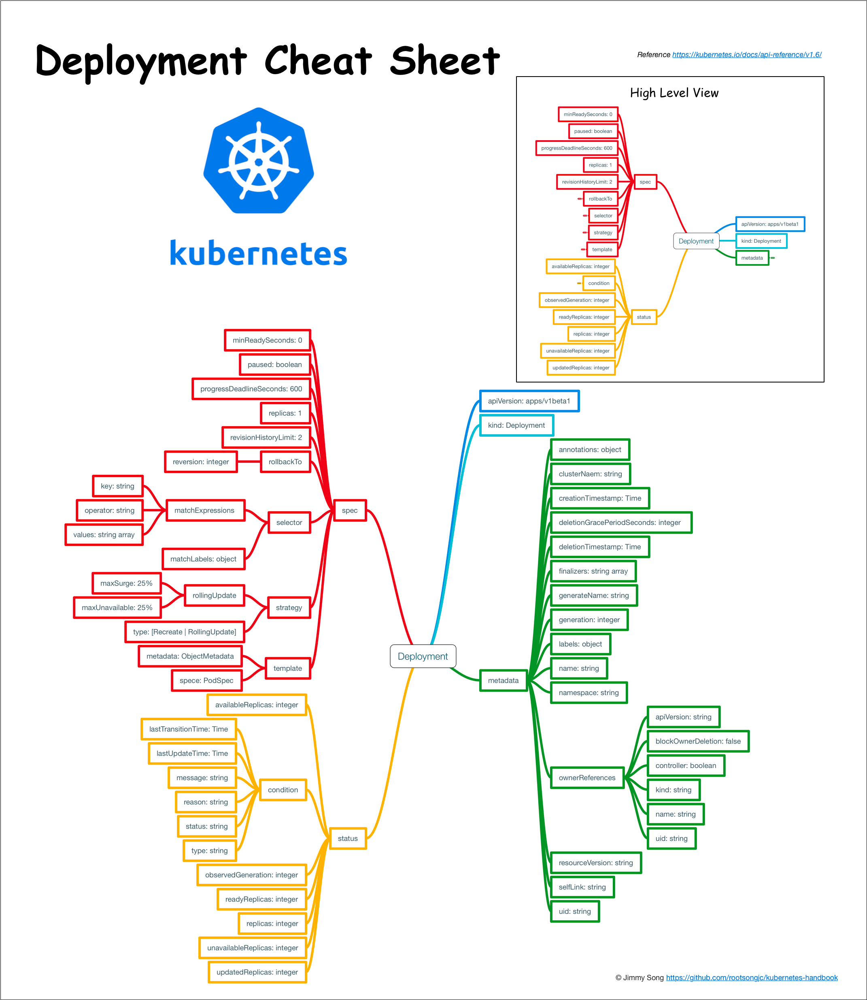

#### Deployment 介绍



- 定义 Deployment 来创建 Pod 和 ReplicaSet
- 滚动升级和回滚应用
- 扩容和缩容
- 暂停和继续 Deployment

1) 扩容    
```shell
kubectl scale deployment nginx-deployment --replicas 10

kubectl autoscale deployment nginx-deployment --min=10 --max=15 --cpu-percent=80
```

2) 更新镜像   
```shell
kubectl set image deployment/nginx-deployment nginx=nginx:1.9.1
```

3) 回滚   
```shell
kubectl rollout undo deployment/nginx-deployment
```

