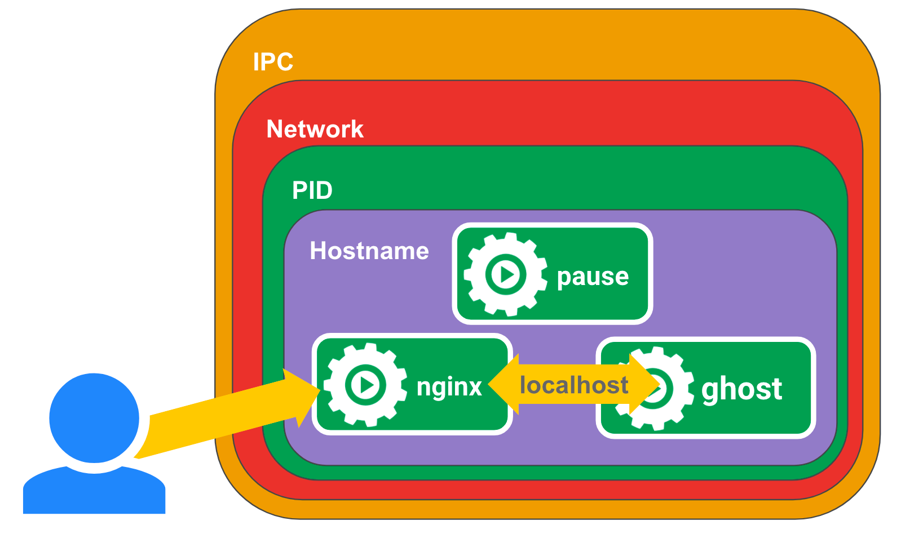

#### Pause 容器

1) pause 容器特点   
- 镜像非常小
- 永远处于 pause() 状态

2) pause 容器背景
- 解决 Pod 中的容器网络

3) Pause 容器实现
- Pod 里面的所有容器，它们看到的网络视图是完全一样的

4) Pause 容器的作用
- 在 Pod 中担任 Linux 命名空间共享的基础
- 启用 pid 命名空间，开启 Init 进程

