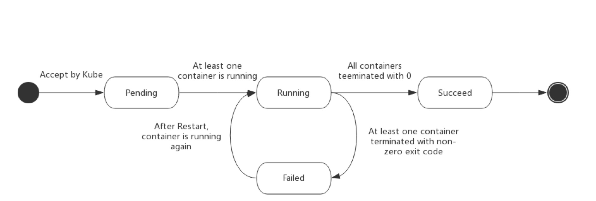

#### pod 的生命周期

1) Pod phase   
- Pending：挂起
  - Pod 已被 Kubernetes 系统接受，但有一个或者多个容器镜像尚未创建
- Running：运行
  - 该 Pod 已经绑定到了一个节点上，Pod 中所有的容器都已被创建
- Succeeded：成功
  - Pod 中的所有容器都被成功终止，并且不会再重启
- Failed：失败
  - Pod 中的所有容器都已终止了，并且至少有一个容器是因为失败终止
- Unknown：未知
  - 因为某些原因无法取得 Pod 的状态，通常是因为与 Pod 所在主机通信失败

2) Pod Status   
- PodCondition 数组的每个元素都有一个 type 字段和一个 status 字段
  - PodScheduled
  - Ready
  - Initialized
  - Unschedulable
  - ContainersReady

3) 容器探针   
kubelet 调用由容器实现的 Handler：   
- ExecAction：容器内执行指定命令。如果命令退出时返回码为 0 则认为诊断成功
- TCPSocketAction：对指定端口上的容器的 IP 地址进行 TCP 检查
- HTTPGetAction：对指定的端口和路径上的容器的 IP 地址执行 HTTP Get 请求

kubelet 可以选择是否执行在容器上运行的两种探针：   
- livenessProbe：指示容器是否正在运行
- readinessProbe：指示容器是否准备好服务请求

- readinessGates：只有到 Pod 中的所有容器状态都是 Ready，且 Pod 附加的额外状态检测的 readinessGates 条件也是 Ready 的时候，Pod 的状态才是 Ready。

4) Pod 和容器状态    
- PodStatus 
- ContainerStatus

5) 重启策略
- restartPolicy
  - Always
  - OnFailure
  - Never
