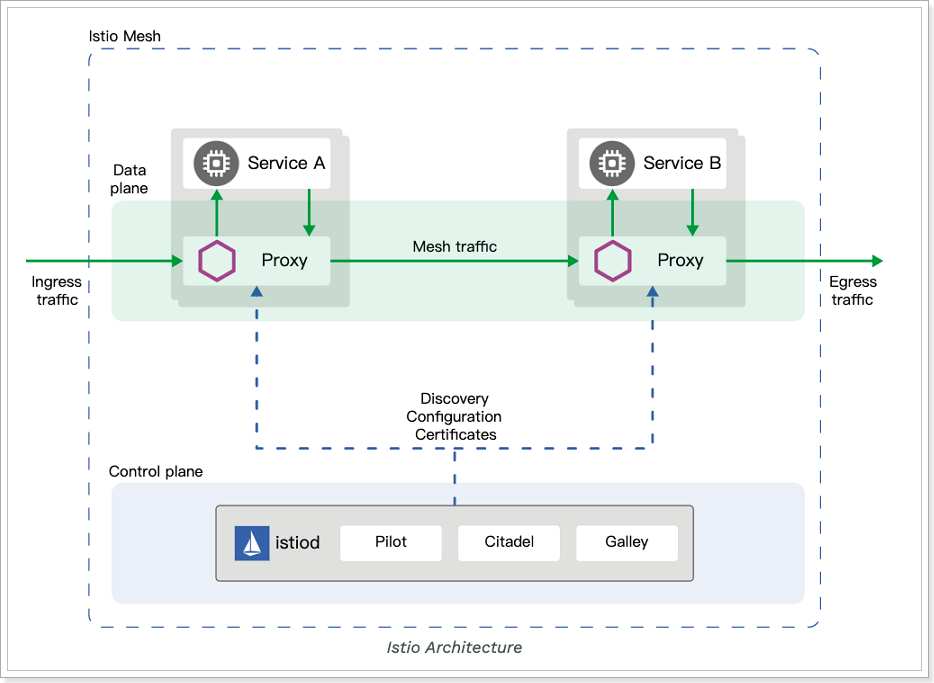

#### istio
istio 是 service Mesh 架构的一种实现，服务间的通信会通过代理（Envoy）来实现；

1) istio 架构    


- Pilot：为 Envoy 提供了服务发现，流量管理和智能路由（AB 测试、金丝雀发布等），以及错误处理（超时、重试、熔断）功能。
- Citadel：为服务之间提供认证和证书管理，可以让服务自动升级成 TLS 协议。
- Galley：Galley 是 Istio 的配置验证、提取、处理和分发组件。它负责将其余的 Istio 组件与从底层平台（例如 Kubernetes）获取用户配置的细节隔离开来。

2) istio 功能    
- 为 HTTP，gRPC，WebSocket 和 TCP 流量自动负载均衡
- 通过丰富的路由规则、重试、故障转移和故障注入对流量行为进行细粒度控制
- 可插拔的策略层和配置 API，支持访问控制、速率限制和配额
- 集群内（包括集群的入口和出口）所有流量的自动化度量、日志记录和追踪
- 在具有强大的基于身份验证和授权的集群中实现安全的服务间通信

---
TLS Ingress   

1) 证书创建
```shell
// 创建一个根证书及私钥
openssl req -x509 -sha256 -nodes days 365 -newkey rsa:2048 -subj '/O=exampleInc./CN=example.com'
-keyout example.com.key -out example.com.crt
```

为 Ingress 网关将要暴露的服务创建一个新的证书和私钥：
```shell
openssl req -out httpbin.example.com.csr -newkey rsa:2048 -nodes
-keyout httpbin.example.com.key -subj "/CN=httpbin.example.com/O=httpbin organization"

openssl x509 -req -days 365 -CA example.com.crt -CAkey example.com.key -set_serial 0
-in httpbin.example.com.csr -out httpbin.example.com.crt
```

2) TLS 认证

证书下发：   
- 通过文件挂载来下发证书
- Envoy 提供 SDS 协议下发证书

创建 kubernetes Secret 保存刚刚创建的证书文件：
```shell
kubectl create -n istio-system secret tls istio-ingressgateway-certs --key httpbin.example.com.key --cert httpbin.example.com.crt 
```

3) 双向认证

- 客户端对服务端的验证
- 服务端对客户端的验证

创建客户端证书：
```shell
openssl req -out httpbin-client.example.com.csr -newkey rsa:2048 -nodes 
-keyout 
```

---
参考文章：
- https://blog.csdn.net/bxg_kyjgs/article/details/125599452

