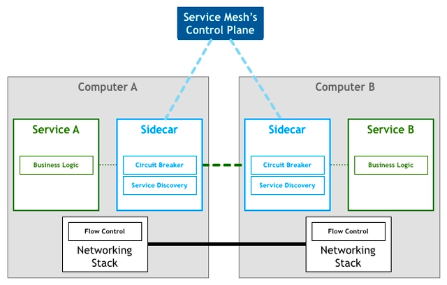
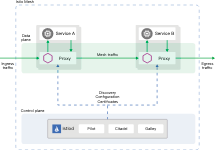

#### Service Mesh 

1) Service Mesh 特点
- 应用程序间通信的中间层
- 轻量级网络代理
- 应用程序无感知
- 解耦应用程序的重试，超时，监控，追踪，服务发现

2) Service Mesh 基本原理
负责服务之间的调用，限流，熔断和监控    

- Service Mesh 的架构

3) Service Mesh 方案    
- Linkerd 
- Istio

1、Istio    
- 架构图

---
1) 服务网格
- 流量治理
  - 负载均衡策略
  - 按比例切流
  - 按自定义业务策略切流
  - 错误重试
  - 熔断保护
- 可观测性
  - 请求参数监控 (延时、5XX 分析统计)
  - 开箱即用调用链
- 安全性
  - mtls 通道级安全
  - jwt token 安全认证

---
1、服务网格如何工作
1) 控制平面将整个网格中的服务推送到所有节点的 sidecar 代理中
2) sidecar 代理将服务请求路由到目的地址
3) 当 sidecar 确认了目的地址后，将流量发送到相应的服务发现端点，在 kubernetes 中是 service，然后 service 会将服务转发给后端的实例
4) sidecar 根据它观测到的最近请求的延迟时间，选择出所有应用程序中响应最快的实例
5) sidecar 将请求发送给该实例，同时记录响应类型和延迟时间
6) 如果该实例挂了，不响应了或者进程不工作了，sidecar 将请求发送到其他实例进行重试
7) 如果该实例持续返回 error，sidecar 会将该实例从负载均衡池中移除，稍后再周期性的重试
8) 如果请求的截止时间已过，sidecar 主动失败该请求，而不是再次尝试添加负载
9) sidecar 以 metric 和分布式追踪的形式捕获上述行为的各个方面，将追踪信息集中发送到 metric 系统中

---

---
参考文档: 

