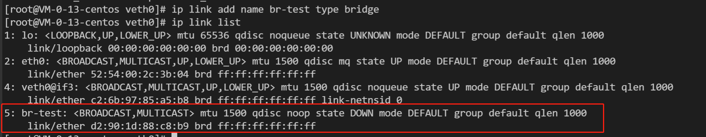
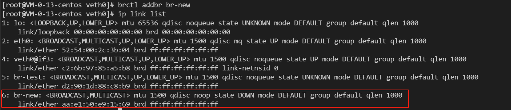
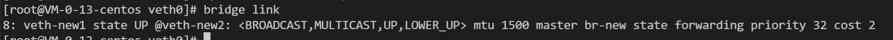
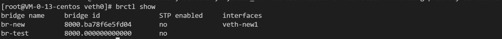

### bridge: 
多个 network namespace 中间进行连接（二层网络设备）

1、创建网桥
```shell
ip link add name <bridge-name> type bridge
```


2、启动网桥
```shell
ip link set <bridge-name> up
```

---
---
1、通过 brctl 工具进行创建网桥：（工具在 bridge-utils 包中）
```shell
brctl addbr br-new
```


2、查看当前网桥上网络设备
```shell
bridge link
```


```shell
brctl show
```


3、删除网桥上的 veth 设备
```shell
brctl delif <br-name> <veth-name>
```
