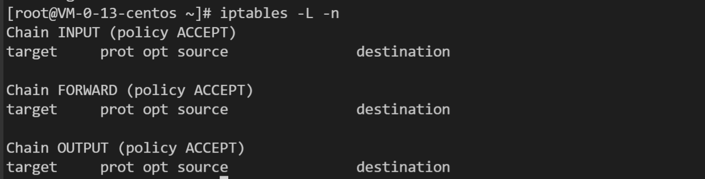

1、查看 iptables 规则
```shell
iptables -L -n
```


默认输出 filter 表, -t nat 输出 nat 表规则；

2、配置内置链的默认策略
- 默认的不让进
```shell
iptables --policy INPUT DROP
```
- 默认的不允许转发
```shell
iptables --policy FORWARD DROP
```
- 默认的可以出去
```shell
iptables --policy OUTPUT ACCEPT
```

3、配置防火墙规则策略
- 配置允许 SSH 链接
```shell
iptables -A INPUT -s 10.20.30.40/24 -p tcp --dport 22 -j ACCEPT
```
- 端口转发
```shell
iptables -A PREROUTING -t nat -i eth0 -p tcp --dport 80 -j REDIRECT --to-port 8080
```
- 禁用 PING
```shell
iptables -A INPUT -p icmp -j DROP
```

4、删除规则
- 清除所有规则
```shell
iptables -F
```
- 删除一条或多条规则
```shell
iptables -D INPUT -s 10.10.10.10 -j DROP
```
- 删除自定义的空链
```shell
iptables -X BAR
```

5、创建自定义链
```shell
iptables -N BAR
```

6、DNAT
```shell
iptables -t nat -A PREROUTING -d 1.2.3.4 -p tcp --dport 80 -j DNAT --to-destination 10.20.30.40:80 
```

7、SNAT
```shell
iptables -t nat -A POSTROUTING -s 192.168.1.2 -j SNAT --to-source 10.172.16.1
```

8、路由规则保存
```shell
iptables-save
iptables-restore
```

---

##### 1) iptables 三板斧：
- table
- chain
- rule

##### 2) iptables 5X5 表链：
- INPUT: 一般用于处理输入本地进程数据包
- OUTPUT: 一般用于处理本地进程的输出数据包
- FORWARD: 一般用于处理转发到其他机器 /network namespace 的数据包
- PREROUTING: 可以在此处进行 DNAT
- POSTROUTING: 可以在此处进行 SNAT

- filter: 用于控制到达某条链上的数据包是继续放行，直接丢弃（drop）或者拒绝（reject）
- nat：用于修改数据包的源和目的地址
- mangle: 用于修改数据包的 IP 头信息
- raw：iptables 是有状态的，iptables 对数据包有跟踪（connecting tracking）机制，而 raw 是用来去除这种追踪机制
- security: 在数据包上应用 SElinux


