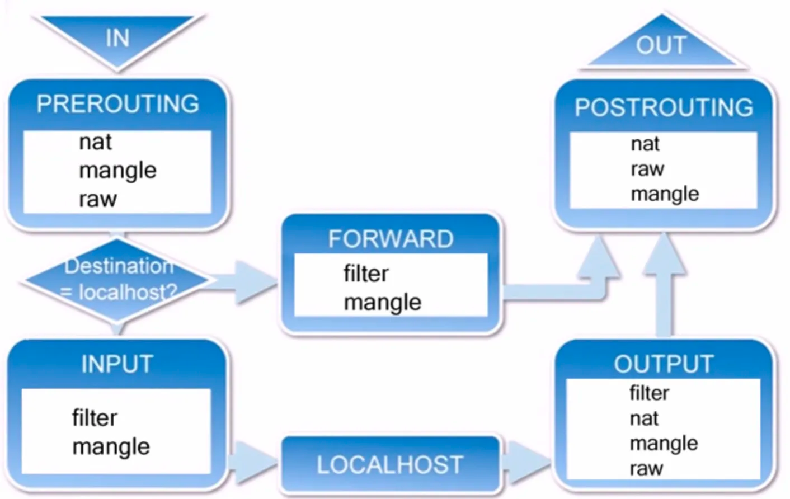

#### netfilter 

通用，抽象的框架，提供一整套 hook 管理机制；使得数据包过滤，包处理（设置标志位，修改 TTL 等）、地址伪装，网络地址转换，透明代理，基于协议类型的链接跟踪；

1、IP 层的 5 个钩子点的位置，对应 iptables 就是 5 条内置链：
- PREROUTING (DNAT)
- INPUT
- FORWARD
- OUTPUT
- POSTROUTING (SNAT)

INPUT --》 本地进程 --》OUTPUT

一个网络包经过 iptables 的处理路径：

