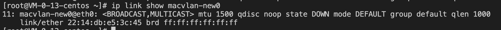

[Macvlan和IPvlan基础知识](https://mp.weixin.qq.com/s/r_CuqjypaaMRDZfW-RHjxw)

1、创建 macvlan 设备
```shell
ip link add <macvlna-name> link eth0 type macvlan mode bridge
```



2、启动 macvlan 设备
```shell
ifconfig <macvlan-new> up
```


