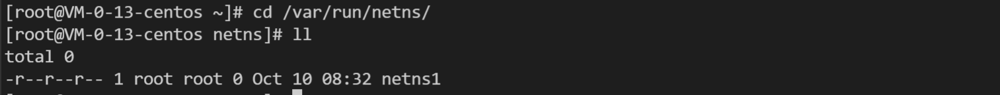
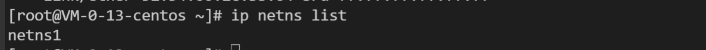
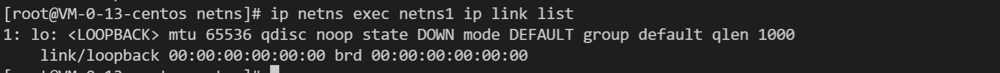

### 常见 netns 操作

1、创建 add
```shell
ip netns add <netns-name>
```


创建完成，会在 /var/run/netns 下生成挂载点：


2、查看 list
```shell
ip netns list
```


3、进入 exec
```shell
ip netns exec <netns-name> ip link list
```


从上图可以看出，自带的 lo 设备状态还是 DOWN:
```shell
ip netns exec <netns-name> ping 127.0.0.1
```


4、删除 delete
```shell
ip netns delete <netns-name>
```


