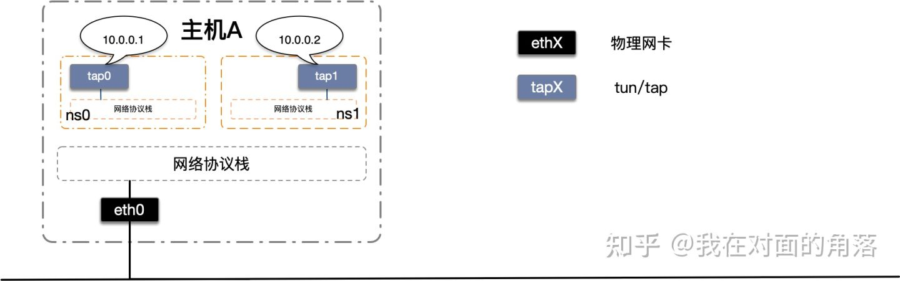
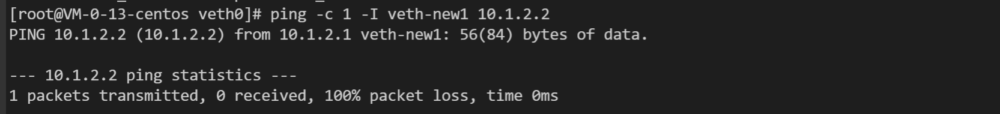
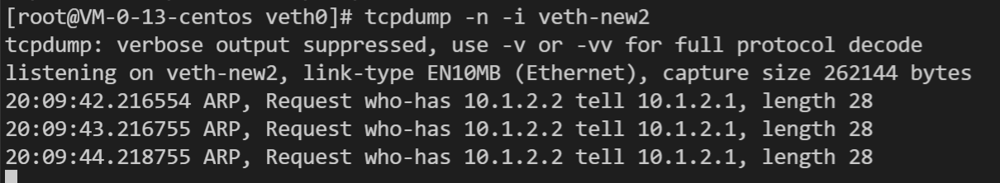

# Network

**【Kubernetes 网络权威指南】**
- 将 P9-P11 中的 c 程序翻译成 go 程序；-- Open

https://zhuanlan.zhihu.com/p/293659403

```shell
# 添加并启动虚拟网卡tap设备
ip tuntap add dev tap0 mode tap 
ip tuntap add dev tap1 mode tap 
ip link set tap0 up
ip link set tap1 up
# 配置IP
ip addr add 10.0.0.1/24 dev tap0
ip addr add 10.0.0.2/24 dev tap1
# 添加netns
ip netns-cmd add ns0
ip netns-cmd add ns1
# 将虚拟网卡tap0，tap1分别移动到ns0和ns1中
ip link set tap0 netns-cmd ns0
ip link set tap1 netns-cmd ns1
```

```shell
# Linux 命令
route -n
iptables -L
```
---

netns/veth/bridge 创建

```shell
ip netns add netns-new
ip netns exec netns-new ip link set dev lo up
ip link add veth-new1 type veth peer name veth-new2
ip addr add 10.1.2.1/24 dev veth-new1
ip addr add 10.1.2.2/24 dev veth-new2
ip link set veth-new1 up
ip link set veth-new2 up

ip link add name br-new type bridge
brctl addbr br-bew

ip link set br-new up

ip link set dev veth-new1 master br-new
brctl addif br-new veth-new1

```

从 veth-new1 ping veth-new2:
```shell
ping -c 1 -I veth-new1 10.1.2.2
```


veth-new1 加入网桥后，此时是 ping 不通的；

抓包分析：
```shell
tcpdump -n -i veth-new2
```


```shell
tcpdump -n -i br-new
```
