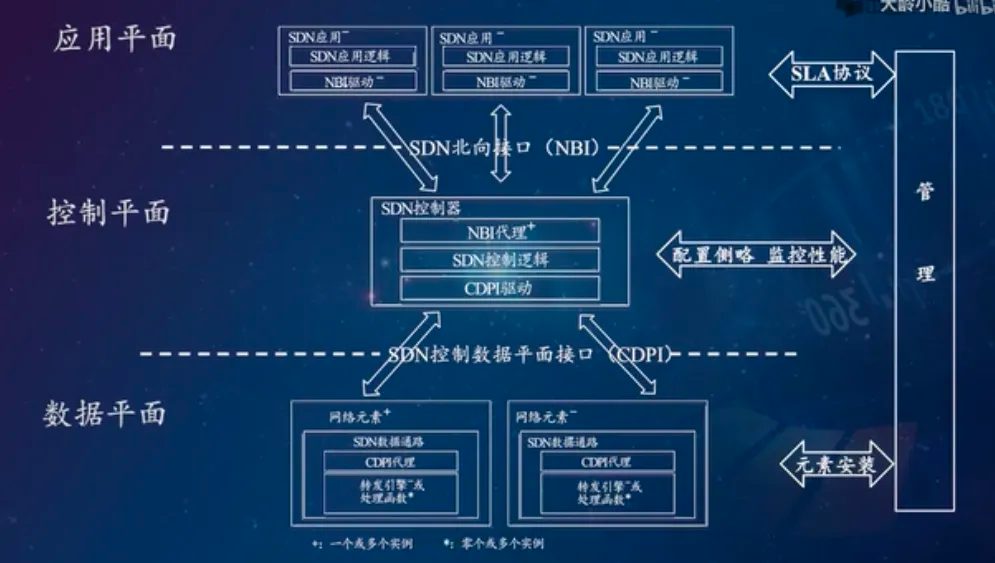
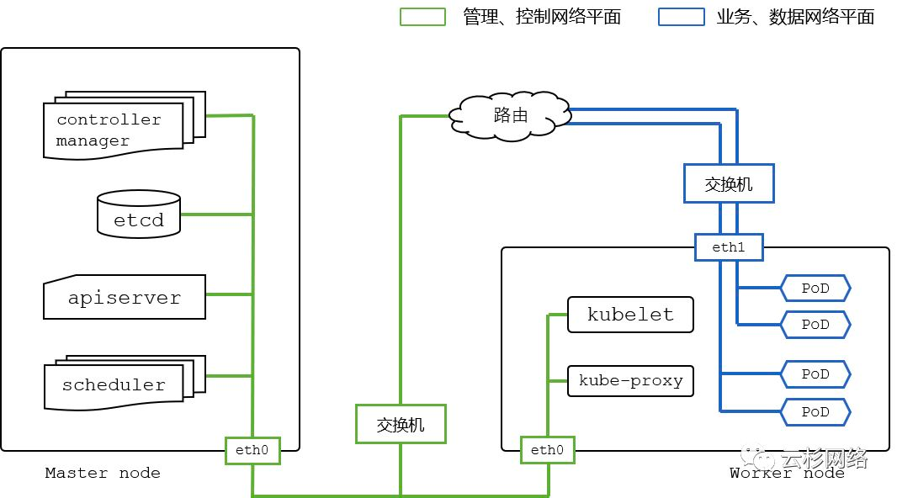
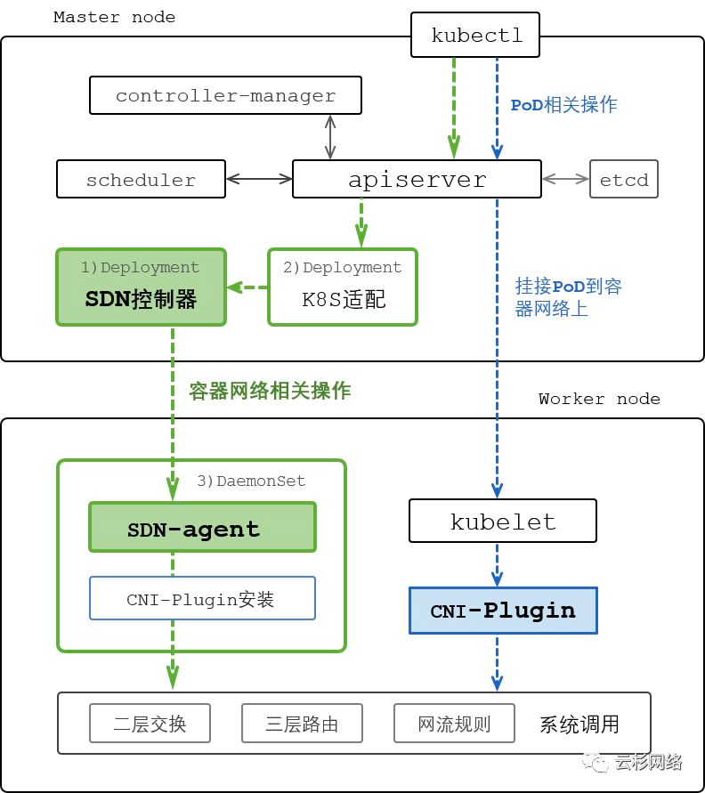

#### SDN（Software Defined Network）软件定义网络

1、SDN 分类
- 控制与转发分离
- 管理与控制分离

2、SDN 三个主要特征
- 转控分离：网元的控制平面在控制器上，负责协议计算，产生流表；而转发平面只在网络设备上。
- 集中控制：设备网元通过控制器集中管理和下发流表，这样就不需要对设备进行逐一操作，只需要对控制器进行配置即可。
- 开放接口：第三方应用只需要通过控制器提供的开放接口，通过编程方式定义一个新的网络功能，然后在控制器上运行即可。

3、SDN 网络架构

k8s 网络平面隔离配置：

SDN 控制器、代理、及 CNI PLugin 在 k8s 上部署：

