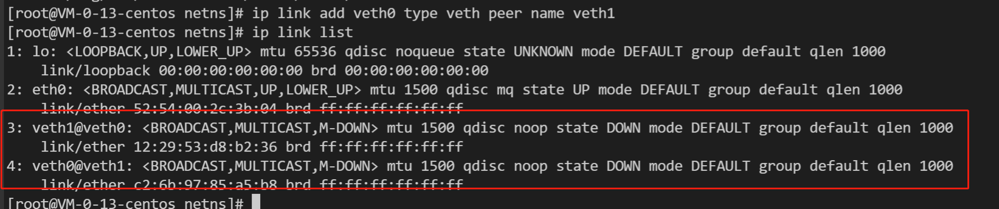
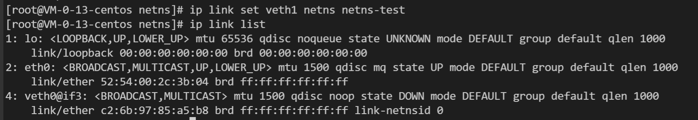
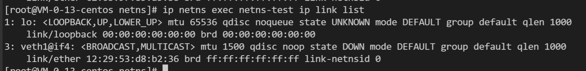
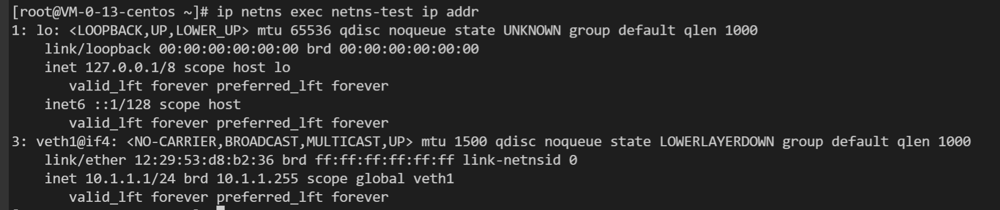
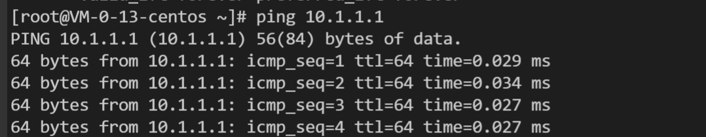
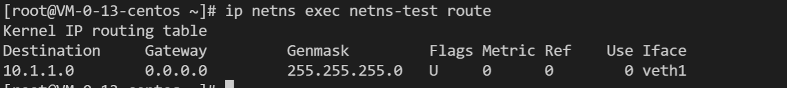
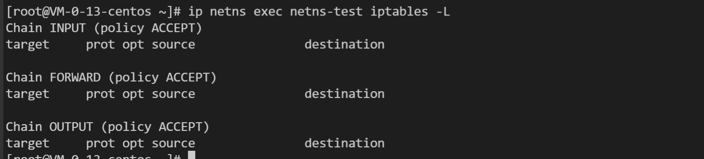

1、创建一对虚拟的 veth-pair 以太网卡
```shell
ip link add veth0 type veth peer name veth1
```


2、将 veth 的一端放入另一个 netns
```shell
ip link set veth1 netns <netns-name>
```
当前的 netns 中将看不到 veth1:

在放入的另一个 netns 中可以看到 veth1:


给 veth1 配置 IP 并启动：
```shell
ip netns exec <netns-name> ifconfig veth1 10.1.1.1/24 up
```


给 veth0 配置 IP 并启动：
```shell
ifconfig veth0 10.1.1.2/24 up
```


检查网络连通：



3、查看路由



新创建的 network namespace 不和主机共享路由表和防火墙规则；
