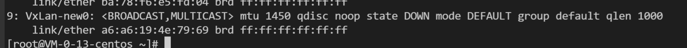
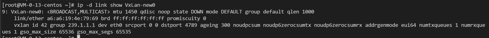
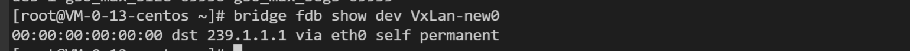
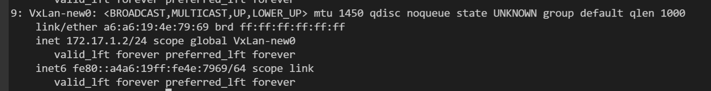
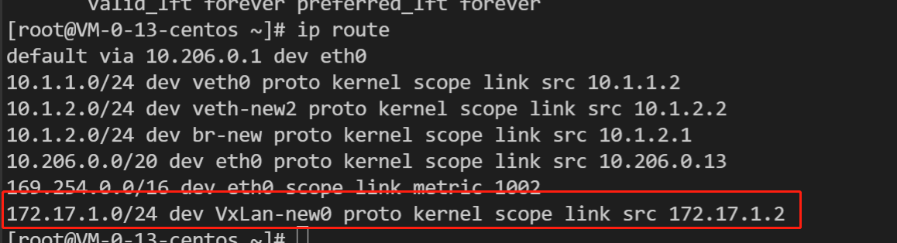
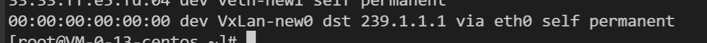

### VxLa 基本配置命令

1、创建 VxLan 接口
```shell
ip link add VxLan-new0 type vxlan id 42 group 239.1.1.1 dev eth0 dstport 4789
```



2、删除 VxLan 接口
```shell
ip link delete <vxlan-name>
```

3、查看 VxLan 接口信息
```shell
ip -d link show <vxlan-name>
```


4、查看 VxLan 接口转发表
```shell
bridge fdb show dev <vxlan-name>
```


- 配置 IP:
```shell
ip addr add 172.17.1.2/24 dev <vxlan-name>
```
- 启用：
```shell
ip link set <vxlan-name> up
```


- 查看路由：
```shell
ip route
```


```shell
bridge fdb
```


